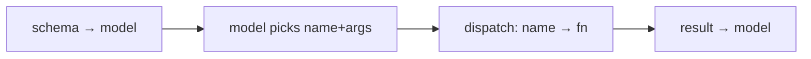

# Tool Schemas & Dispatch by Hand

> **Motto** — A tool is a function plus a schema that teaches the model how to call it.

*Part of Phase 03 — Tool Engineering. Builds on Phase 2's agent loop.*

## The Problem

The agent loop (Phase 2) dispatched tools from a hand-written dict. Real tools need more:
the model has to *know they exist* and *how to call them*, which means each tool carries a
**schema** (name, description, input shape). And dispatch has to map the model's chosen
name+args to the right Python function. Get the schema wrong and the model calls tools
incorrectly or not at all.

## The Concept

A tool has two halves: the **schema** (sent to the model) and the **implementation** (run
by the harness).



The schema is JSON-Schema-shaped: `name`, `description`, `input_schema` with typed
properties and a `required` list.

## Build It

`code/tools.py` — a decorator that registers a function *and* derives its schema, plus a
dispatcher:

```python
REGISTRY = {}

def tool(name, description, schema):
    def deco(fn):
        REGISTRY[name] = {"fn": fn, "schema": {
            "name": name, "description": description, "input_schema": schema}}
        return fn
    return deco

@tool("add", "Add two numbers.",
      {"type": "object",
       "properties": {"a": {"type": "number"}, "b": {"type": "number"}},
       "required": ["a", "b"]})
def add(a, b):
    return a + b

def schemas():
    return [t["schema"] for t in REGISTRY.values()]

def dispatch(name, args):
    entry = REGISTRY.get(name)
    if not entry:
        return f"error: unknown tool {name!r}"
    return str(entry["fn"](**args))
```

```python
print([s["name"] for s in schemas()])   # ['add']
print(dispatch("add", {"a": 2, "b": 3})) # 5
print(dispatch("nope", {}))              # error: unknown tool 'nope'
```

The decorator keeps schema and implementation together, so they never drift apart — the
#1 source of "the model calls the tool wrong" bugs.

## Use It

This list of schemas is exactly what you pass as `tools=` to `messages.create`. The model
returns `tool_use` blocks naming a tool and its input; your `dispatch` runs it. You built
the registry the SDK consumes.

## Ship It

[`code/tools.py`](../../01-schemas-and-dispatch/code/tools.py) — a `@tool` decorator,
`schemas()`, and `dispatch()`.

## Check Yourself

**Q1.** What are a tool's two halves?

- A) name and price
- B) the schema sent to the model and the implementation run by the harness
- C) input and output
- D) prompt and response

<details><summary>Answer</summary>B — schema teaches the model; implementation does the
work.</details>

**Q2.** Why keep schema and implementation together (e.g. via a decorator)?

- A) brevity
- B) so they can't drift apart, which causes wrong-call bugs
- C) speed
- D) no reason

<details><summary>Answer</summary>B — co-location prevents schema/impl drift.</details>

**Challenge.** Auto-derive the `input_schema` from the function's type hints so you don't
hand-write it.

## Related

- Builds on: Phase 2 — [The Agent Loop](../../../02-the-agent-loop/01-agent-loop/docs/en.md)
- Next: [Argument validation](../../02-argument-validation/docs/en.md)
- [Roadmap](../../../../ROADMAP.md)
