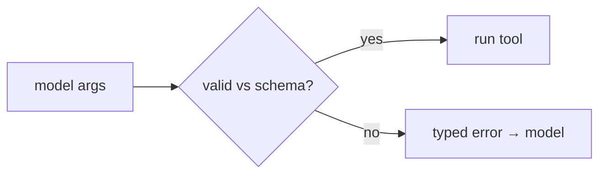

# Argument Validation & JSON-Schema Enforcement

> **Motto** — The model proposes arguments; the harness proves they're valid before running anything.

*Part of Phase 03 — Tool Engineering.*

## The Problem

The model fills in tool arguments from a schema, but it can still get them wrong: a missing
required field, a string where a number belongs, a value outside an allowed set. If you call
the function anyway you get a Python traceback (or worse, a silently wrong action). Validate
against the schema first, and a bad call becomes a clean message the model can fix.

## The Concept

A small JSON-Schema subset covers most tool inputs: `type`, `required`, `enum`, and nested
`properties`.



## Build It

`code/validate.py` — a minimal schema validator returning a precise error or `None`:

```python
TYPES = {"string": str, "number": (int, float), "integer": int,
         "boolean": bool, "object": dict, "array": list}

def validate(args, schema):
    if schema.get("type") == "object":
        for key in schema.get("required", []):
            if key not in args:
                return f"missing required field {key!r}"
        for key, spec in schema.get("properties", {}).items():
            if key in args:
                err = _check(args[key], spec, key)
                if err:
                    return err
    return None

def _check(value, spec, path):
    t = spec.get("type")
    if t and not isinstance(value, TYPES[t]):
        return f"{path}: expected {t}, got {type(value).__name__}"
    if "enum" in spec and value not in spec["enum"]:
        return f"{path}: {value!r} not in {spec['enum']}"
    return None
```

```python
schema = {"type": "object",
          "properties": {"unit": {"type": "string", "enum": ["c", "f"]},
                         "temp": {"type": "number"}},
          "required": ["temp"]}
print(validate({"temp": 20, "unit": "c"}, schema))   # None (valid)
print(validate({"unit": "k"}, schema))               # missing required 'temp'
print(validate({"temp": "hot"}, schema))             # temp: expected number, got str
```

The error strings are written for the *model* to read — name the field and what was wrong,
so it self-corrects in one turn.

## Use It

Providers do some validation, but you should validate at the dispatch boundary too:
defense in depth, and your messages are tuned for recovery. This is the same
errors-are-data principle from the agent loop, applied to arguments.

## Ship It

[`code/validate.py`](../../02-argument-validation/code/validate.py) — a minimal JSON-schema
argument validator.

## Check Yourself

**Q1.** A model passes a string for a numeric field. Validation should…

- A) crash the loop
- B) return a typed error naming the field so the model retries correctly
- C) coerce silently
- D) ignore it

<details><summary>Answer</summary>B — clear, model-readable errors enable
self-correction.</details>

**Q2.** Why validate even though the provider checks the schema?

- A) it's required
- B) defense in depth, and you control the error wording for recovery
- C) speed
- D) you shouldn't

<details><summary>Answer</summary>B — validate at your boundary too.</details>

**Challenge.** Add `minimum`/`maximum` for numbers and `minLength` for strings to the
validator.

## Related

- Builds on: [Tool schemas & dispatch](../../01-schemas-and-dispatch/docs/en.md)
- Next: [Tool results, errors & the feedback channel](../../03-results-and-errors/docs/en.md)
- [Roadmap](../../../../ROADMAP.md)
