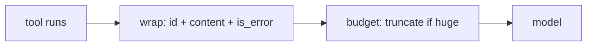

# Tool Results, Errors & the Feedback Channel

> **Motto** — A tool result is a message back to the model — shape it so the model can use it.

*Part of Phase 03 — Tool Engineering.*

## The Problem

After a tool runs, its output goes back to the model as a `tool_result`. How you shape that
result determines whether the model uses it well: huge raw dumps blow the context budget,
unlabeled errors confuse it, and missing the `is_error` flag means failures look like
success. The feedback channel needs structure.

## The Concept

A well-formed result carries: the `tool_use_id` it answers, a concise `content`, and an
`is_error` flag.



Three rules: pair to the request id, mark errors explicitly, and cap the size (truncate
with a note rather than dumping 50KB).

## Build It

`code/results.py` — wrap outcomes into result blocks with truncation:

```python
MAX_RESULT_CHARS = 4000

def ok(tool_use_id, content):
    return _block(tool_use_id, str(content), is_error=False)

def err(tool_use_id, message):
    return _block(tool_use_id, f"error: {message}", is_error=True)

def _block(tool_use_id, content, is_error):
    if len(content) > MAX_RESULT_CHARS:
        head = content[:MAX_RESULT_CHARS]
        content = f"{head}\n…[truncated {len(content) - MAX_RESULT_CHARS} chars]"
    return {"type": "tool_result", "tool_use_id": tool_use_id,
            "content": content, "is_error": is_error}
```

```python
print(ok("t1", 42))                          # is_error False
print(err("t2", "file not found"))           # is_error True
print(_block("t3", "x" * 5000, False)["content"][-30:])  # …[truncated 1000 chars]
```

The truncation note matters: the model knows output was cut, rather than silently reasoning
over a partial result.

## Use It

These dicts are exactly the `tool_result` content blocks you append as a user turn in the
SDK loop. The `is_error` flag tells the model to treat the content as a failure to recover
from. Truncation here is the first taste of context engineering (Phase 4).

## Ship It

[`code/results.py`](../../03-results-and-errors/code/results.py) — `ok()`/`err()` result
wrappers with size capping.

## Check Yourself

**Q1.** Why set `is_error` on a failed tool result?

- A) logging
- B) so the model treats it as a failure to recover from, not a valid answer
- C) speed
- D) no reason

<details><summary>Answer</summary>B — the flag changes how the model interprets the
content.</details>

**Q2.** A tool returns 50KB. The result wrapper should…

- A) send it all
- B) truncate with a note so the model knows output was cut
- C) drop it
- D) summarize with another model call (always)

<details><summary>Answer</summary>B — cap with a visible truncation marker.</details>

**Challenge.** Add a `summarize_if_over` option that, past a threshold, replaces the body
with a short head+tail slice plus a line count, instead of a hard cut.

## Related

- Builds on: [Argument validation](../../02-argument-validation/docs/en.md)
- Next: [Idempotency & side-effecting tools](../../04-idempotency/docs/en.md)
- [Roadmap](../../../../ROADMAP.md)
