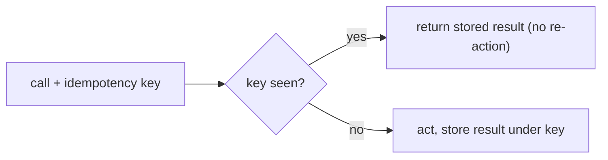

# Idempotency & Side-Effecting Tools

> **Motto** — The loop may retry; a side-effecting tool must not act twice.

*Part of Phase 03 — Tool Engineering.*

## The Problem

Read-only tools are safe to retry. But the moment a tool *does* something — sends an email,
charges a card, creates a file, opens a PR — retries become dangerous. The agent loop
retries on errors (Phase 2 lesson 06), a transient network blip can re-trigger a call, and
a confused model can repeat itself. Without idempotency you get double-sends and duplicate
charges: the most expensive class of tool bug because it touches the real world.

## The Concept

Make each side-effecting call carry an **idempotency key** derived from its intent. The
harness records completed keys; a repeat with the same key returns the stored result instead
of acting again.



## Build It

`code/idempotency.py` — a wrapper that dedupes by key:

```python
class Idempotent:
    def __init__(self):
        self._done = {}                        # key -> result

    def run(self, key, action):
        if key in self._done:
            return self._done[key], "replayed"
        result = action()                      # the real side effect
        self._done[key] = result
        return result, "executed"

def key_for(tool, args):
    import hashlib, json
    blob = json.dumps([tool, args], sort_keys=True)
    return hashlib.sha256(blob.encode()).hexdigest()[:16]
```

```python
idem = Idempotent()
sends = []
send = lambda: (sends.append("email"), "sent")[1]
k = key_for("send_email", {"to": "a@b.com"})
print(idem.run(k, send))     # ('sent', 'executed')
print(idem.run(k, send))     # ('sent', 'replayed')  ← no second send
print("emails sent:", len(sends))   # 1
```

One real action, even though the loop "called" twice. The key is derived from intent, so an
identical request dedupes while a different one proceeds.

## Use It

In production the `_done` store is durable (a DB/Redis), keyed by a client-supplied
idempotency key, often with a TTL. Many real APIs (payments especially) accept an
`Idempotency-Key` header for exactly this reason — your wrapper is the agent-side
counterpart.

## Ship It

[`code/idempotency.py`](../../04-idempotency/code/idempotency.py) — an idempotency wrapper +
key derivation.

## Check Yourself

**Q1.** Why do side-effecting tools need idempotency but read-only ones don't?

- A) they're slower
- B) retries on a side-effecting tool cause double actions (double-send/charge)
- C) the model prefers it
- D) they don't

<details><summary>Answer</summary>B — retries are safe for reads, dangerous for
writes.</details>

**Q2.** What should the idempotency key be derived from?

- A) the current time
- B) the call's intent (tool + args), so identical requests dedupe
- C) a random number
- D) the model name

<details><summary>Answer</summary>B — intent-derived keys dedupe repeats but let distinct
calls through.</details>

**Challenge.** Add a TTL so keys expire, and make `run` re-execute (not replay) once a key
has aged out.

## Related

- Builds on: [Results & errors](../../03-results-and-errors/docs/en.md)
- Next: [Tool budgets & rate limits](../../05-tool-budgets/docs/en.md)
- Related: Phase 14 — Reliability (retries)
- [Roadmap](../../../../ROADMAP.md)
