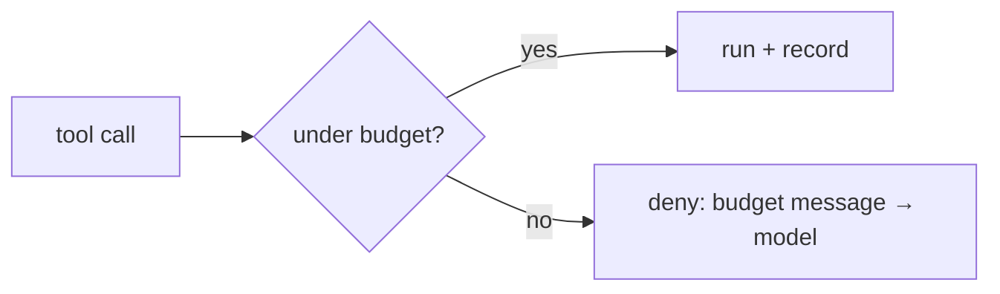

# Tool Budgets & Rate Limits

> **Motto** — Cap how often and how much the agent can act, before it caps your bill.

*Part of Phase 03 — Tool Engineering.*

## The Problem

A tool the agent can call freely is a tool it can call 200 times. Termination (Phase 2)
bounds *steps*, but a single step can fire many tool calls, and some tools are expensive or
rate-limited upstream. You need per-tool ceilings — total calls, calls per window — enforced
at the dispatch boundary, so a runaway plan or a hammering loop is stopped early.

## The Concept



Two limits cover most cases: a **total** count per request, and a **rate** (N per rolling
window) to respect upstream limits.

## Build It

`code/budgets.py` — a budget guard usable as a pre-dispatch gate (a PreToolUse hook in a
real harness):

```python
import time

class ToolBudget:
    def __init__(self, max_total=20, per_window=5, window_s=10):
        self.max_total, self.per_window, self.window_s = max_total, per_window, window_s
        self.total = 0
        self.calls = []                        # timestamps within the window

    def allow(self, now=None):
        now = now if now is not None else time.time()
        self.calls = [t for t in self.calls if now - t < self.window_s]
        if self.total >= self.max_total:
            return False, "total tool budget exhausted"
        if len(self.calls) >= self.per_window:
            return False, f"rate limit: max {self.per_window}/{self.window_s}s"
        self.calls.append(now); self.total += 1
        return True, None
```

```python
b = ToolBudget(max_total=20, per_window=2, window_s=10)
print(b.allow(now=0))    # (True, None)
print(b.allow(now=0))    # (True, None)
print(b.allow(now=0))    # (False, 'rate limit: max 2/10s')
print(b.allow(now=11))   # (True, None)  ← window slid
```

A denied call returns a message to the model ("budget exhausted") — the agent can wrap up
gracefully instead of crashing.

## Use It

In Claude Code this is a `PreToolUse` hook (Phase 8): it inspects the pending tool call and
exits non-zero to deny when over budget. The same guard protects an upstream API's rate
limit by keying the window per tool.

## Ship It

[`code/budgets.py`](../../05-tool-budgets/code/budgets.py) — a total + rolling-window tool
budget guard.

## Check Yourself

**Q1.** Why aren't step ceilings (Phase 2) enough?

- A) they are
- B) one step can fire many tool calls, so you also need per-tool/call ceilings
- C) steps are unlimited
- D) tools are free

<details><summary>Answer</summary>B — bound calls and rate, not just steps.</details>

**Q2.** When a tool budget is hit, the harness should…

- A) crash
- B) deny the call with a message so the model can wrap up
- C) silently allow it
- D) double the budget

<details><summary>Answer</summary>B — deny gracefully; never auto-extend.</details>

**Challenge.** Add per-tool budgets (a different ceiling for an expensive tool vs. a cheap
one) keyed by tool name.

## Related

- Builds on: [Idempotency](../../04-idempotency/docs/en.md)
- Next: [Writing tool descriptions](../../06-tool-descriptions/docs/en.md)
- Deepens in: Phase 8 — Permissions (hooks), Phase 14 — Reliability
- [Roadmap](../../../../ROADMAP.md)
