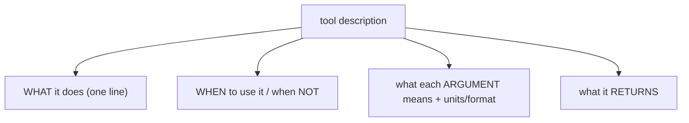

# Writing tool descriptions the model obeys

> **Motto** — The description is the model's only manual — write it for the model, not for humans.

*Part of Phase 03 — Tool Engineering.*

## The Problem

You can have perfect schemas and dispatch and still get bad tool use, because the model
chooses *whether* and *how* to call a tool from its **description**. Vague descriptions
cause the model to skip the tool, call it for the wrong thing, or pass bad arguments. The
description is prompt engineering aimed at the model's tool-selection step.

## The Concept

A good tool description answers four questions the model is implicitly asking:

Lead with the action verb, name the trigger conditions explicitly, and spell out argument
formats (units, allowed values, examples). Anti-pattern: a noun phrase ("Weather tool")
that tells the model nothing about when to reach for it.

## Build It (a description rubric)

The artifact is a written rubric plus before/after examples. `outputs/tool-description-rubric.md`:

- **What** — one sentence, action-first: "Fetch current weather for a city."
- **When / when not** — "Use when the user asks about current conditions. Do not use for
  forecasts (use `forecast`)."
- **Arguments** — each with type, units, format, example: "`city`: name, e.g. 'Paris';
  `unit`: 'c' or 'f'."
- **Returns** — "A short string like 'Paris: 18°C, clear.'"

Before: `"Weather."` → After: the four-part version above. The model now knows exactly when
and how to call it.

## Use It

These strings populate the `description` field of each tool schema (lesson 01) sent to the
model. When an eval (Phase 15) shows the model misusing a tool, the first fix is usually the
description — not the model, and not the prompt (principle: patch the harness).

## Ship It

[`outputs/tool-description-rubric.md`](../../06-tool-descriptions/outputs/tool-description-rubric.md)
— a rubric + before/after examples for writing tool descriptions.

## Check Yourself

**Q1.** The model decides whether to call a tool mainly from its…

- A) implementation
- B) description (and schema)
- C) name only
- D) return type

Answer
B — the description drives selection and argument
filling.

**Q2.** The model keeps calling the wrong tool. First fix?

- A) a bigger model
- B) clarify the tool descriptions (what/when/args/returns)
- C) lower temperature
- D) remove the tool

Answer
B — sharpen the descriptions before anything
else.

**Challenge.** Take a tool with a one-word description, rewrite it with the four-part
rubric, and note what ambiguity each part removes.

## Related

- Builds on: [Tool schemas & dispatch](../../01-schemas-and-dispatch/docs/en.md)
- Next: [SDK tool definitions & parallel tool use](../../07-sdk-parallel-tools/docs/en.md)
- Deepens in: Phase 5 — Prompt Architecture
- [Roadmap](../../../../ROADMAP.md)
