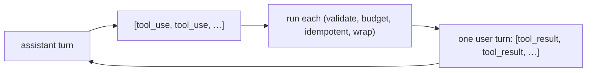

# Use it: SDK tool definitions & parallel tool use

> **Motto** — One model turn can request several tools at once — run them, return all results.

*Part of Phase 03 — Tool Engineering. Builds on the whole phase.*

## The Problem

You've built schemas, validation, results, idempotency, and budgets by hand. Now wire them
to the real SDK — and handle the case the toy loop glossed over: the model can emit
**multiple `tool_use` blocks in one turn**. If you only run the first, the model waits
forever for the rest; if you return results in the wrong shape, the API rejects them.

## The Concept



All results for a turn go back together in a single user message, each paired by
`tool_use_id`. Independent tools can run concurrently.

## Build It (wire the phase together)

`code/parallel_tools.py` — defaults to **Claude Opus 4.8**, composes this phase's pieces:

```python
import anthropic
from concurrent.futures import ThreadPoolExecutor
client = anthropic.Anthropic()

# schemas() / dispatch() from lesson 01; validate() from 02; ok()/err() from 03.
def run_call(call):
    err_msg = validate(call.input, SCHEMA_BY_NAME[call.name])
    if err_msg:
        return err(call.id, err_msg)
    try:
        return ok(call.id, dispatch(call.name, call.input))
    except Exception as e:
        return err(call.id, str(e))

def step(messages, tools):
    msg = client.messages.create(model="claude-opus-4-8", max_tokens=1024,
                                 tools=tools, messages=messages)
    messages.append({"role": "assistant", "content": msg.content})
    calls = [b for b in msg.content if b.type == "tool_use"]
    if not calls:
        return messages, "".join(b.text for b in msg.content if b.type == "text")
    with ThreadPoolExecutor() as pool:                 # independent tools run in parallel
        results = list(pool.map(run_call, calls))
    messages.append({"role": "user", "content": results})
    return messages, None
```

Each result reuses your hand-built validation and wrapping. Parallelism is safe *because*
side-effecting tools are idempotent (lesson 04).

## Use It

This is the production tool loop: pass `tools=schemas()`, collect every `tool_use`, run them
(in parallel when independent), and return all `tool_result` blocks in one user turn. The SDK
also supports forcing a specific tool via `tool_choice` for structured output.

## Ship It

[`code/parallel_tools.py`](../../07-sdk-parallel-tools/code/parallel_tools.py) — an SDK tool
loop with parallel dispatch composing the whole phase.

## Check Yourself

**Q1.** A turn has three `tool_use` blocks. You should…

- A) run only the first
- B) run all three and return three `tool_result` blocks in one user turn
- C) error
- D) run them across three separate turns

<details><summary>Answer</summary>B — answer every requested call together.</details>

**Q2.** What makes parallel tool execution safe?

- A) luck
- B) idempotent side-effecting tools (lesson 04) plus independent inputs
- C) a bigger model
- D) lower temperature

<details><summary>Answer</summary>B — idempotency guards against overlap/retry
hazards.</details>

**Challenge.** Add `tool_choice={"type": "tool", "name": "extract"}` to force the model to
produce a structured object via a single tool — the robust structured-output path from
Phase 1 lesson 07.

## Related

- Builds on: lessons [01](../../01-schemas-and-dispatch/docs/en.md)–[06](../../06-tool-descriptions/docs/en.md)
- Next: [A tool registry & discovery layer](../../08-tool-registry/docs/en.md)
- [Roadmap](../../../../ROADMAP.md)
