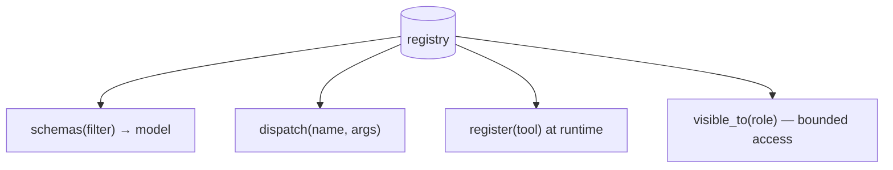

# A tool registry & discovery layer

> **Motto** — As tools multiply, the harness needs a registry it can list, filter, and expose.

*Part of Phase 03 — Tool Engineering. Completes the phase.*

## The Problem

One tool is a dict entry. Fifty tools — across files, plugins, and MCP servers (Phase 12) —
need a single place that knows them all: to produce the `tools=` schema list, to dispatch by
name, to filter which tools a given agent/role may see (bounded roles, Phase 10), and to add
tools at runtime. Without a registry, tool wiring sprawls and you can't scope what an agent
can do.

## The Concept



## Build It

`code/registry.py` — a registry with registration, filtered schema export, dispatch, and
role scoping:

```python
class Registry:
    def __init__(self):
        self._tools = {}                       # name -> {fn, schema, tags}

    def register(self, name, fn, schema, tags=()):
        self._tools[name] = {"fn": fn, "schema": {**schema, "name": name}, "tags": set(tags)}

    def schemas(self, allow=None):
        return [t["schema"] for n, t in self._tools.items()
                if allow is None or n in allow]

    def visible_to(self, role_allow):
        """Schemas a role may use (bounded roles, Phase 10)."""
        return self.schemas(allow=role_allow)

    def dispatch(self, name, args, allow=None):
        if allow is not None and name not in allow:
            return f"error: tool {name!r} not permitted for this role"
        t = self._tools.get(name)
        if not t:
            return f"error: unknown tool {name!r}"
        return str(t["fn"](**args))
```

```python
r = Registry()
r.register("add", lambda a, b: a + b,
           {"description": "Add.", "input_schema": {}}, tags=["math"])
r.register("rm", lambda path: f"removed {path}",
           {"description": "Delete a file.", "input_schema": {}}, tags=["danger"])
print([s["name"] for s in r.visible_to({"add"})])     # ['add'] — reviewer can't see rm
print(r.dispatch("rm", {"path": "x"}, allow={"add"})) # error: not permitted
```

The `allow` set is the seam where permissions (Phase 8) and bounded roles (Phase 10) plug
in: the same registry exposes different tools to different agents.

## Use It

The registry produces `tools=` for the SDK and routes `tool_use` calls to implementations.
MCP servers (Phase 12) register their tools here on connect, so discovered tools and local
tools share one dispatch path.

## Ship It

[`code/registry.py`](../code/registry.py) — a tool registry with
runtime registration, filtered schemas, dispatch, and role scoping.

## Check Yourself

**Q1.** Why route all tools through one registry?

- A) style
- B) single place to list schemas, dispatch, and scope which tools an agent can see
- C) speed
- D) no reason

<details><summary>Answer</summary>B — central wiring + scoping.</details>

**Q2.** How does the registry support bounded roles (Phase 10)?

- A) it doesn't
- B) `schemas(allow=…)`/`dispatch(allow=…)` expose only permitted tools per role
- C) by renaming tools
- D) by deleting tools

<details><summary>Answer</summary>B — the allow-set scopes visibility and dispatch.</details>

**Challenge.** Add `tags`-based filtering (e.g. exclude all `danger`-tagged tools for a
low-trust agent) and a `describe()` that prints the catalog.

## Related

- Builds on: [SDK parallel tools](../../07-sdk-parallel-tools/docs/en.md)
- Used by: Phase 8 — Permissions, Phase 10 — Bounded roles, Phase 12 — MCP
- Phase complete → next: Phase 4 — [Context Engineering](../../../../ROADMAP.md)
- [Roadmap](../../../../ROADMAP.md)
