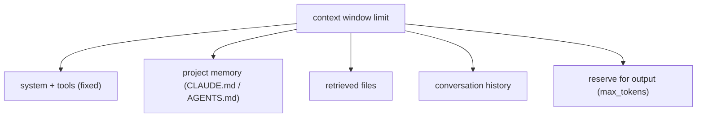

# Context budgeting & token accounting

> **Motto** — Treat the context window as a budget you allocate, not a bucket you fill.

*Part of Phase 04 — Context Engineering.*

## The Problem

A coding agent's window fills fast: system prompt, tool schemas, project files
(`CLAUDE.md`/`AGENTS.md`), conversation history, tool results. Left unmanaged it overflows
and the harness either errors or truncates blindly — dropping exactly the file the model
needed. You need an explicit budget: how many tokens each *category* may consume, checked
before every call.

## The Concept



Allocate the window across categories with a reserve for output. When a category exceeds
its slice, that category gets trimmed/compacted (later lessons) — not whatever happens to
be oldest.

## Build It

`code/budget.py` — a category budgeter:

```python
def estimate(text):
    return max(1, round(len(text) / 4))      # ~4 chars/token (Phase 1)

class ContextBudget:
    def __init__(self, limit, reserve_output, weights):
        self.limit, self.reserve = limit, reserve_output
        self.weights = weights               # category -> fraction of remaining

    def allocation(self):
        usable = self.limit - self.reserve
        return {cat: int(usable * w) for cat, w in self.weights.items()}

    def check(self, sizes):
        alloc = self.allocation()
        return {cat: (sizes.get(cat, 0), alloc[cat], sizes.get(cat, 0) <= alloc[cat])
                for cat in alloc}
```

```python
b = ContextBudget(limit=200_000, reserve_output=8000,
                  weights={"system": .05, "memory": .10, "files": .45, "history": .40})
for cat, (used, cap, ok) in b.check({"files": 100_000, "history": 90_000}).items():
    print(cat, used, cap, "OK" if ok else "OVER")
```

Now "the window is full" becomes "the *files* category is over its 45% slice" — an
actionable signal pointing at what to trim.

## Use It

In **Claude Code / Codex** you don't set these numbers directly, but the same budgeting
governs what the agent loads: a lean `CLAUDE.md`/`AGENTS.md` (project memory), on-demand
file reads instead of dumping the repo, and automatic history compaction when the window
fills. This lesson is the model behind those behaviors — and why a bloated memory file
crowds out the files the agent actually needs.

## Ship It

[`code/budget.py`](../../01-context-budgeting/code/budget.py) — a category context budgeter.

## Check Yourself

**Q1.** Why budget by *category* instead of just dropping the oldest messages?

- A) it's faster
- B) so you trim the right thing (e.g. bloated files) instead of losing needed history
- C) the API requires it
- D) no reason

<details><summary>Answer</summary>B — category budgets make overflow actionable.</details>

**Q2.** Why reserve tokens for output?

- A) style
- B) input + max_output share the window; without a reserve the reply gets truncated
- C) speed
- D) no reason

<details><summary>Answer</summary>B — leave room for the model to answer.</details>

**Challenge.** Add a `fit()` method that, given over-budget categories, returns how many
tokens each must shed — the input to truncation (lesson 03) and compaction (lesson 04).

## Related

- Builds on: Phase 1 — [Tokens](../../../01-llm-io-foundations/02-tokens-and-context-window/docs/en.md)
- Next: [Message assembly & ordering](../../02-message-assembly/docs/en.md)
- [Roadmap](../../../../ROADMAP.md)
