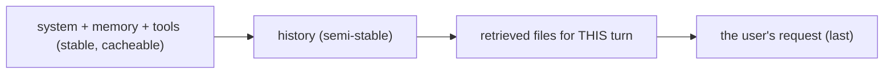

# Message Assembly & Ordering

> **Motto** — Assemble context in a fixed order: stable first, volatile last.

*Part of Phase 04 — Context Engineering.*

## The Problem

The same pieces — system prompt, project memory, tool schemas, retrieved files, history,
the new user turn — can be arranged many ways. Order matters for two reasons: caching
(stable-first keeps the cached prefix valid, Phase 1 lesson 08) and salience (the model
weights recent/closing context heavily). A haphazard assembler quietly kills your cache
hit rate and buries the current task.

## The Concept



A canonical order: stable/cacheable prefix → history → this-turn context → the request
itself last, so the model's attention lands on the actual ask.

## Build It

`code/assembly.py` — a deterministic assembler:

```python
def assemble(system, memory, history, files, user_msg):
    system_block = "\n\n".join(filter(None, [system, memory]))   # stable, cacheable
    messages = list(history)                                      # semi-stable
    if files:                                                     # this-turn context
        joined = "\n\n".join(f"<file path=\"{p}\">\n{c}\n</file>" for p, c in files)
        messages.append({"role": "user", "content": f"Relevant files:\n{joined}"})
    messages.append({"role": "user", "content": user_msg})        # the ask, last
    return system_block, messages
```

```python
sys_block, msgs = assemble(
    system="You are a coding agent.",
    memory="Project: use the public API barrel.",
    history=[{"role": "user", "content": "hi"}, {"role": "assistant", "content": "hello"}],
    files=[("api.py", "def add(a,b): ...")],
    user_msg="Add a subtract function.")
print(sys_block.splitlines()[0]); print("msgs:", len(msgs))   # files + ask appended last
```

The assembler is the single place ordering is decided, so caching and salience are
consistent across every call.

## Use It

This mirrors how **Claude Code / Codex** lay out a turn: the system prompt and project
memory (`CLAUDE.md` / `AGENTS.md`) form the stable, cached head; files the agent reads are
injected for the current turn; your message comes last. Keeping memory files lean and
stable is what makes the cached prefix pay off (Phase 1 lesson 08).

## Ship It

[`code/assembly.py`](../../02-message-assembly/code/assembly.py) — a deterministic context
assembler.

## Check Yourself

**Q1.** Why put stable content first?

- A) readability
- B) it keeps the cacheable prefix valid and is cheaper to reuse
- C) the API sorts it
- D) no reason

<details><summary>Answer</summary>B — stable-first maximizes cache hits (Phase 1 L8).</details>

**Q2.** Why does the user's actual request go last?

- A) tradition
- B) the model weights closing context heavily, so the ask stays salient
- C) it's shorter
- D) no reason

<details><summary>Answer</summary>B — recency keeps the task in focus.</details>

**Challenge.** Make `assemble` take the `ContextBudget` (lesson 01) and skip/trim file
injection when the files category is over budget.

## Related

- Builds on: [Context budgeting](../../01-context-budgeting/docs/en.md)
- Next: [Truncation that doesn't break tool calls](../../03-truncation/docs/en.md)
- [Roadmap](../../../../ROADMAP.md)
