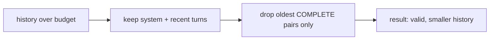

# Truncation That Doesn't Break Tool Calls

> **Motto** — Trim oldest-first, but never split a tool_use from its tool_result.

*Part of Phase 04 — Context Engineering.*

## The Problem

When history exceeds budget, the obvious fix is to drop the oldest messages. But a coding
agent's history is full of `tool_use`/`tool_result` pairs, and the API rejects a
conversation where a `tool_use` has no matching `tool_result` (Phase 2 lesson 04). Naive
truncation produces exactly that invalid state. Trimming must respect pairing.

## The Concept



Rule: drop whole exchanges (a user/assistant turn plus any tool pair it spawned), never a
half-pair. Always keep the most recent turns intact.

## Build It

`code/truncate.py` — pair-aware truncation:

```python
def truncate(messages, max_tokens, est, keep_recent=4):
    """Drop oldest complete exchanges until under budget; never split tool pairs."""
    msgs = list(messages)
    def size(ms): return sum(est(str(m.get("content", ""))) for m in ms)
    while size(msgs) > max_tokens and len(msgs) > keep_recent:
        # find the end of the oldest exchange (advance past any tool messages)
        cut = 1
        while cut < len(msgs) - keep_recent and msgs[cut]["role"] == "tool":
            cut += 1
        del msgs[:cut]                              # drop a whole leading exchange
    return msgs
```

```python
est = lambda s: max(1, len(s)//4)
msgs = [{"role": "user", "content": "x"*400} for _ in range(10)]
print(len(truncate(msgs, max_tokens=200, est=est)))   # trimmed, recent kept
```

The loop removes leading exchanges as a unit, so a `tool_use` and its `tool_result` are
always dropped together — the conversation stays valid.

## Use It

When a session gets long, **Claude Code / Codex** don't just hard-cut — they compact
(next lesson). But the invariant is the same: the running message list they send must keep
every tool call paired. If you ever build a custom loop on the Agent SDK, this pair-aware
trim is the floor under it.

## Ship It

[`code/truncate.py`](../../03-truncation/code/truncate.py) — pair-aware history truncation.

## Check Yourself

**Q1.** Why can't you drop a single `tool_use` message to save tokens?

- A) it's small
- B) its `tool_result` would be orphaned and the API rejects the conversation
- C) it's recent
- D) you can

<details><summary>Answer</summary>B — pairs must stay together (Phase 2 L4).</details>

**Q2.** What does pair-aware truncation always preserve?

- A) the longest messages
- B) the most recent turns and valid tool pairing
- C) random messages
- D) only the system prompt

<details><summary>Answer</summary>B — recent + valid structure.</details>

**Challenge.** Make truncation *summarize* the dropped exchanges into one note instead of
deleting them outright — the bridge to compaction (next lesson).

## Related

- Builds on: [Message assembly](../../02-message-assembly/docs/en.md), Phase 2 L4 history
- Next: [Compaction & summarization](../../04-compaction/docs/en.md)
- [Roadmap](../../../../ROADMAP.md)
