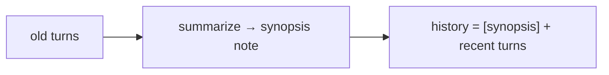

# Compaction & Summarization Across Turns

> **Motto** — When history won't fit, replace it with a summary that preserves the facts that matter.

*Part of Phase 04 — Context Engineering.*

## The Problem

Truncation (lesson 03) keeps the conversation valid but *loses* the dropped content — and
sometimes the agent needed a decision made 30 turns ago. Compaction is the better move:
summarize the old portion into a compact note (key decisions, open threads, file state)
and keep that, so the agent remembers the gist without the full transcript. This is what
"compacting conversation…" means in a long Claude Code / Codex session.

## The Concept



The synopsis must capture: decisions made, current goal/plan, files touched, and unresolved
questions — the working state, not a blow-by-blow.

## Build It

`code/compaction.py` — compaction with a pluggable summarizer (a stub here; the model in
production):

```python
def compact(messages, est, max_tokens, summarize, keep_recent=4):
    def size(ms): return sum(est(str(m.get("content",""))) for m in ms)
    if size(messages) <= max_tokens:
        return messages
    old, recent = messages[:-keep_recent], messages[-keep_recent:]
    synopsis = summarize(old)                       # model call in production
    note = {"role": "user",
            "content": f"[summary of earlier conversation]\n{synopsis}"}
    return [note] + recent

def stub_summarize(old):
    decisions = [m["content"] for m in old if m["role"] == "assistant"]
    return f"{len(old)} earlier messages. Key points: " + " | ".join(decisions[:3])
```

```python
est = lambda s: max(1, len(s)//4)
msgs = [{"role": "assistant", "content": f"decided thing {i}"} for i in range(20)]
out = compact(msgs, est, max_tokens=50, summarize=stub_summarize)
print(out[0]["content"][:40], "…")     # the synopsis replaces the bulk
```

In production `summarize` is a model call with a prompt like *"Summarize the decisions,
current plan, files changed, and open questions."* The structure of the synopsis is what
makes compaction lossy-but-useful instead of lossy-and-harmful.

## Use It

This is exactly the auto-compaction in **Claude Code / Codex**: when the window fills,
the tool summarizes the earlier conversation and continues from the synopsis plus recent
turns. Knowing this, you write your requests so important decisions are stated explicitly
(they survive compaction) and you `/clear` or start fresh when switching tasks.

## Ship It

[`code/compaction.py`](../../04-compaction/code/compaction.py) — history compaction with a
pluggable summarizer.

## Check Yourself

**Q1.** Compaction beats plain truncation because…

- A) it's faster
- B) it preserves the gist (decisions, plan, files) instead of losing it
- C) it uses fewer tokens always
- D) it never calls the model

<details><summary>Answer</summary>B — summary retains working state.</details>

**Q2.** A good synopsis captures…

- A) every message verbatim
- B) decisions, current plan, files touched, open questions
- C) only the last message
- D) the system prompt

<details><summary>Answer</summary>B — the working state, not a transcript.</details>

**Challenge.** Make compaction *recursive*: when the synopsis-plus-recent still overflows,
summarize again, and verify facts from the first summary survive.

## Related

- Builds on: [Truncation](../../03-truncation/docs/en.md)
- Next: [Injecting files & retrieved context safely](../../05-injecting-context/docs/en.md)
- Deepens in: Phase 9 — Memory & Persistence
- [Roadmap](../../../../ROADMAP.md)
