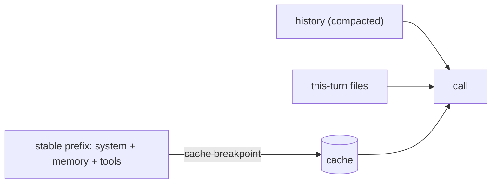

# Context windows in the wild (cache-aware layout)

> **Motto** — Lay the window out so the expensive, stable part is computed once and reused.

*Part of Phase 04 — Context Engineering.*

## The Problem

You've budgeted, assembled, trimmed, compacted, and injected. The last question is
*economic*: a coding agent resends a huge stable prefix every turn (system + memory + tool
schemas). Without a cache-aware layout you pay full price to reprocess it each call — slow
and expensive across a long session. This lesson ties context engineering to prompt
caching (Phase 1 lesson 08).

## The Concept



The whole phase converges here: budget → assemble stable-first → compact history → inject
files last, with a **cache breakpoint** after the stable prefix.

## Build It / Use It

Caching is a provider feature, so this is **Use It** — but the layout is the payoff of
everything you built. `code/cache_aware.py` composes the phase's pieces and marks the
breakpoint, defaulting to **Claude Opus 4.8**:

```python
import anthropic
client = anthropic.Anthropic()

def build_request(memory, tools, history, files, user_msg):
    system = [{
        "type": "text",
        "text": "You are a coding agent.\n\n" + memory,    # stable: persona + project memory
        "cache_control": {"type": "ephemeral"},            # breakpoint after stable prefix
    }]
    messages = list(history)                                # compacted (lesson 04)
    if files:
        messages.append({"role": "user", "content": files})  # this-turn, wrapped (lesson 05)
    messages.append({"role": "user", "content": user_msg})
    return dict(model="claude-opus-4-8", max_tokens=1024,
                system=system, tools=tools, messages=messages)
```

Across a session the stable prefix is written to cache once and read cheaply thereafter;
`usage.cache_read_input_tokens` confirms it.

## Use It

This is precisely why **Claude Code / Codex** keep `CLAUDE.md` / `AGENTS.md` and tool
definitions stable and up front, and compact history rather than rewriting the prefix: a
changed byte early would invalidate the cache. Your takeaway as a user: keep memory files
lean and stable; let the tool manage history. As a builder: never interleave volatile data
into the cached prefix.

## Ship It

[`code/cache_aware.py`](../../06-cache-aware-layout/code/cache_aware.py) — a cache-aware
request builder composing the phase.

## Check Yourself

**Q1.** What invalidates a cached prefix?

- A) a new user message at the end
- B) changing a byte early in the stable prefix
- C) reading the cache
- D) lowering max_tokens

<details><summary>Answer</summary>B — caching reuses an *unchanged* prefix.</details>

**Q2.** Why keep `CLAUDE.md`/`AGENTS.md` lean and stable?

- A) readability only
- B) it's in the cached prefix; bloat costs tokens and churn invalidates the cache
- C) the API requires it
- D) no reason

<details><summary>Answer</summary>B — stable, lean memory maximizes cache value.</details>

**Challenge.** Add a second cache breakpoint after the (stable) tool schemas, and reason
about when two breakpoints help vs. one.

## Related

- Builds on: the whole phase; Phase 1 — [Prompt caching](../../../01-llm-io-foundations/08-prompt-caching/docs/en.md)
- Next: [Measuring context rot](../../07-measuring-context-rot/docs/en.md)
- [Roadmap](../../../../ROADMAP.md)
