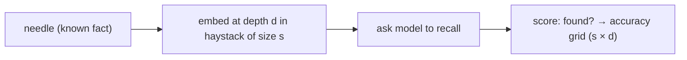

# Measuring Context Rot

> **Motto** — If you can't measure how a full window degrades answers, you're tuning blind.

*Part of Phase 04 — Context Engineering. Completes the phase.*

## The Problem

As the window fills, answer quality drops — the model misses a fact buried among thousands
of tokens, or anchors on stale content. This "context rot" is why budgeting, truncation,
and compaction matter. But which strategy actually helps? You can't tell without a metric.
This lesson builds a tiny eval that *measures* retrieval-from-context as the window grows.

## The Concept

A **needle-in-a-haystack** test: hide a known fact (the needle) in filler (the haystack)
at varying depths and sizes, ask the model to recall it, and score accuracy.



The output is a grid: accuracy by context size × needle depth. Rot shows up as cells
dropping off at large sizes or middle depths.

## Build It

`code/context_rot.py` — the harness, with a stub "model" so it runs offline (swap in a real
call for live numbers):

```python
def make_case(size, depth, needle="The launch code is 4242."):
    filler = "\n".join(f"filler line {i}" for i in range(size))
    lines = filler.splitlines()
    at = int(len(lines) * depth)
    lines.insert(at, needle)
    return "\n".join(lines), needle

def score(answer, needle_value="4242"):
    return 1 if needle_value in answer else 0

def run_grid(ask, sizes=(50, 500), depths=(0.1, 0.5, 0.9)):
    grid = {}
    for s in sizes:
        for d in depths:
            haystack, needle = make_case(s, d)
            answer = ask(haystack, "What is the launch code?")
            grid[(s, d)] = score(answer)
    return grid

def stub_ask(haystack, q):
    # Perfect recall for small contexts; "rots" past a threshold (illustrative).
    return "4242" if len(haystack) < 4000 else "I don't know"
```

```python
g = run_grid(stub_ask)
for (s, d), ok in g.items():
    print(f"size={s:4} depth={d}  {'FOUND' if ok else 'miss'}")
```

Swap `stub_ask` for a real call and you have a reproducible context-rot eval — the kind of
metric Phase 15 formalizes for the whole harness.

## Use It

This is the metric behind the advice you already follow in **Claude Code / Codex**: keep
context lean, `/clear` between tasks, and don't paste enormous files. When you change how
your harness assembles context, re-run a grid like this to prove the change helped instead
of guessing.

## Ship It

[`code/context_rot.py`](../../07-measuring-context-rot/code/context_rot.py) — a
needle-in-a-haystack context-rot eval.

## Check Yourself

**Q1.** What does a needle-in-a-haystack eval measure?

- A) latency
- B) whether the model can recall a known fact as context size/depth varies
- C) token cost
- D) tool accuracy

<details><summary>Answer</summary>B — recall vs. context size and position.</details>

**Q2.** Why measure context rot before changing your assembly strategy?

- A) it's required
- B) so you can prove a change helped instead of guessing
- C) to save tokens
- D) no reason

<details><summary>Answer</summary>B — measurement turns tuning into engineering.</details>

**Challenge.** Add multiple needles and report per-depth accuracy, then compare full-history
vs. compacted-history (lesson 04) on the same grid.

## Related

- Builds on: the whole phase
- Deepens in: Phase 15 — Evals & Testing the Harness
- Phase complete → next: Phase 5 — [Prompt & Instruction Architecture](../../../../ROADMAP.md)
- [Roadmap](../../../../ROADMAP.md)
