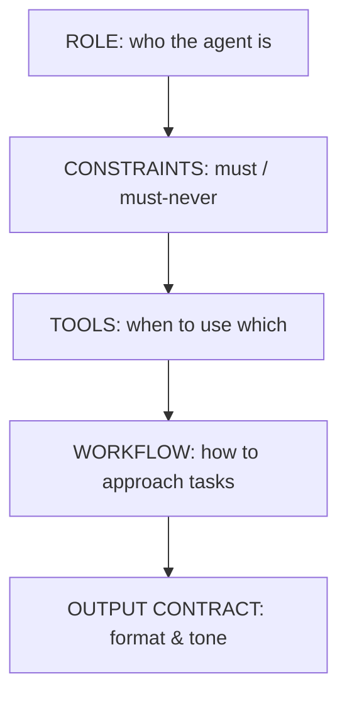

# System prompt and steering

> **Motto** — The system prompt asks. A hook enforces. Know which job each one does.

*Part of Phase 04 — Prompts and instructions.*

*Last reviewed: 2026-10 · Volatility: fast*

## The Problem

The system prompt is the most stable text in the harness, and the most reused. The provider can cache it, so a stable prompt is cheap to reuse.

A vague prompt gives an agent that ignores limits, picks the wrong tool and formats output at random. A bloated prompt wastes the cached prefix and buries the rules that matter.

A second problem is *steering*: the lines that shape how the agent talks and when it asks first. Steering is persuasion. The model usually follows it, but it can fail. A rule that must hold needs code behind it.

## The Concept



Use five sections in a fixed order.

- **Role.** One or two concrete sentences.
- **Constraints.** Imperatives: "Never edit `.env`." "Always run tests before you say done."
- **Tools.** When to use each tool, and when not to. Name the overlap.
- **Workflow.** The default approach, and when to stop and ask.
- **Output contract.** Format, length and tone.

Keep volatile data out. A date, a path or a branch name in the prefix changes the text, and one changed byte early invalidates the cache (see [Tokens, context and caching](../../../01-foundations-and-the-loop/02-tokens-context-and-caching/docs/en.md)). Put per-turn facts in the user message.

Steering lines go in the section they shape. Tone goes in the output contract. "Ask before irreversible actions" goes in the workflow. A refusal style goes in the constraints. For a safety limit, the steering is the polite front and a hook is the wall behind it.

## Build It

`code/prompt_builder.py` builds the prompt, lints it and shows the guard.

```python
def build_prompt(role, constraints, tools, workflow, output, steering=()):
    body = {"Role": [role], "Constraints": list(constraints), "Tools": list(tools),
            "Workflow": list(workflow), "Output contract": list(output)}
    for name in steering:
        section, text = STEERING[name]
        body[section].append(text)
    return "\n\n".join(f"## {s}\n" + "\n".join(f"- {line}" for line in body[s]) for s in SECTIONS)
```

The `STEERING` table holds four reusable lines: be terse, ask before irreversible actions, refuse in one sentence with an alternative, and report test failures honestly. Each maps to a section.

The `lint` function finds the defects above. It flags a wrong section order, volatile data (dates, clock times, home paths, UUIDs), a constraint that is not an imperative, and a prompt that is too long. The `guard` function is a model of a hook. It denies an edit to any `.env` file, whatever the model says. It models only the file tools. A real hook must also inspect Bash (`echo x > .env`), and a `Read(./.env)` deny rule covers the file tools too.

```python
def guard(tool, args):
    """A model of a PreToolUse hook: code that enforces the rule whatever the model says."""
    if tool in ("edit", "write") and args.get("path", "").split("/")[-1].startswith(".env"):
        return "deny", "never edit .env files"
    return "allow", ""
```

The asserts check that two builds give the same bytes, that steering lands in the right section, that each lint rule fires on a bad prompt, and that the guard blocks `.env` while it allows `src/app.py`. The prompt only asks. The guard decides. The real hook is in [Hooks](../../../06-permissions-and-security/02-hooks/docs/en.md).

## Use It

Claude Code ships its own system prompt for software engineering tasks. You add to it. An output style changes the role, tone and format for a whole session. Switch with `/output-style <style>` or set `outputStyle` in settings. Custom styles are Markdown files in `.claude/output-styles`. They drop the built-in coding instructions unless the file sets `keep-coding-instructions: true`.

Pick the feature by the job:

| You want | Use |
| --- | --- |
| A voice, length or format for every reply | An output style |
| Claude to know project facts | `CLAUDE.md` (next lesson) |
| Steps for one kind of task | A skill |
| Something to happen every time | A hook |
| An addition at startup | `--append-system-prompt` |

The docs say plainly that an output style gives instructions to follow. It does not guarantee anything. For a block or a must-happen step, use a hook.

## Challenge

Write an ask-versus-act rule as code. Classify three actions: rename a local variable, delete a file, push to `main`. Return `act` or `confirm`. Assert the answers, then check that your steering line and your code agree.

## Sources

Claude Code docs, "Output styles" (code.claude.com/docs/en/output-styles).

Next: [Memory files](../../02-memory-files/docs/en.md)
