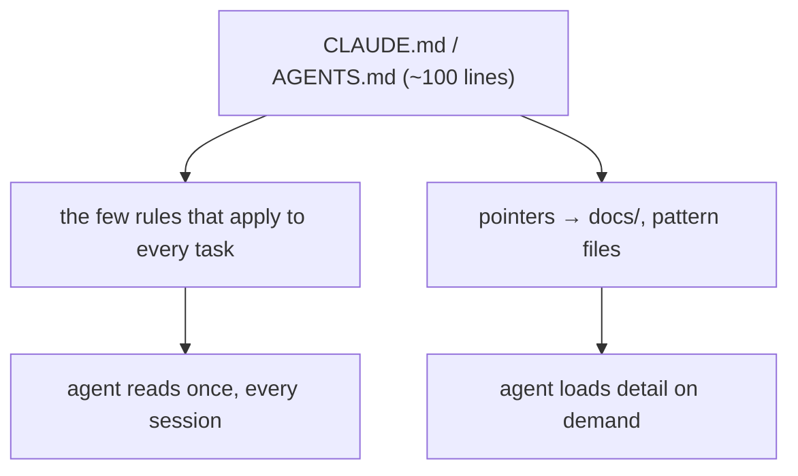

# Memory files

> **Motto** — A memory file is a short, stable table of contents, not an encyclopedia.

*Part of Phase 04 — Prompts and instructions.*

*Last reviewed: 2026-10 · Volatility: fast*

## The Problem

`CLAUDE.md` and `AGENTS.md` are how you put durable, project-specific instructions into every session. The failure is easy to predict. The file grows into a 2,000-line manual. The agent follows it less. You stop updating it. It also uses budget on every turn, as [Context budget](../../../03-context-and-memory/01-context-budget/docs/en.md) shows.

The Claude Code docs give the reason: the file is context, not enforced configuration. Longer files use more context and lower adherence. A good memory file is short. It holds the few rules that apply to every task and points to detail elsewhere.

## The Concept



Put in the file:

- **Commands** the agent will need: test, lint, run.
- **Conventions** that are non-obvious and recurring.
- **Pointers** to deeper docs, not the docs themselves.

Leave out anything volatile, anything the system prompt already says, and anything you would not re-read. Write instructions you can check. "Use 2-space indentation" is checkable. "Format code properly" is not.

When the agent repeats a mistake, do not add a paragraph. Fix the harness: add a lint rule or a hook. Add to the file only when a fact is true in every session.

The docs advise a target under 200 lines per file. Under 100 is this course's rule of thumb.

## Build It

`outputs/CLAUDE.md` is a real lean example: 17 lines of content for a small service. `code/memory_lint.py` checks it, and it models how Claude Code loads these files.

```python
def lint(text, files=None, root=None):
    problems = []
    full = expand(text, files or {})
    lines = [line for line in full.splitlines() if line.strip()]
    if len(lines) > MAX_LINES:
        problems.append(f"{len(lines)} lines after imports; keep under {MAX_LINES}")
    for phrase in VAGUE:
        if phrase in full.lower():
            problems.append(f"vague instruction: {phrase!r}")
    if re.search(r"\b20\d\d-\d\d-\d\d\b", full):
        problems.append("date in a memory file goes stale")
    for ref in re.findall(r"`((?:docs|src)/[\w./-]+)`", full):   # a pointer to a missing file is a trap
        if root and not os.path.exists(os.path.join(root, ref)):
            problems.append(f"pointer to a missing file: {ref}")
    return problems
```

The lint measures size after expanding `@imports`. That is the point: an import organizes a file but does not make it cheaper, because imported files also load at launch. It also flags vague lines, dates, and pointers to files that do not exist.

The asserts prove the example passes with real `docs/` files and fails when they are missing. They also prove that HTML comments are stripped before the model sees the text, that a 250-line file behind an import still counts, and that the closest file is read last.

Two more functions model the load rules. `which_files` encodes the `AGENTS.md` table. `load_order` concatenates layers from broad to specific.

## Use It

Put `CLAUDE.md` at the repo root, or in `.claude/CLAUDE.md`. Claude Code reads files from your working directory and every directory above it. It orders them from the filesystem root down, so instructions closest to you come last. Files in subdirectories load on demand, when Claude reads files there. Run `/init` to generate a starter file. Run `/context` and check **Memory files** to confirm a file loaded.

By default, Claude Code reads `AGENTS.md` only when no `CLAUDE.md` is in your working directory or above it. Claude Code v2.1.277 or later can read `AGENTS.md` directly in that case. To share one file with other tools on any version, write `@AGENTS.md` in your `CLAUDE.md`.

Block-level HTML comments are stripped before injection, so leave maintainer notes in them. For rules that matter only for some paths, use `.claude/rules/` with a `paths` frontmatter field. Those load when Claude touches matching files. For a task procedure, use a skill.

`CLAUDE.md` is guidance. To block an action regardless of what Claude decides, use a hook: [Hooks](../../../06-permissions-and-security/02-hooks/docs/en.md).

## Challenge

Run `memory_lint.py` logic on the real `CLAUDE.md` of a repo you own. Fix every problem it reports. Then cut the file to under 100 lines without losing a command.

## Sources

Claude Code docs, "How Claude remembers your project" (code.claude.com/docs/en/memory).

Next: [Output contracts](../../03-output-contracts/docs/en.md)
