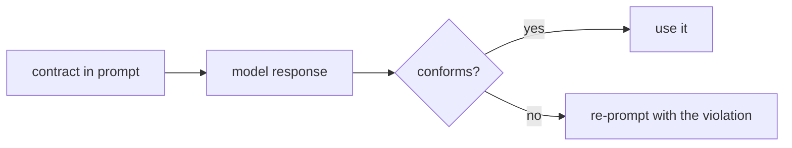

# Output contracts

> **Motto** — State the output contract, then verify the output meets it. Do not just hope.

*Part of Phase 04 — Prompts and instructions.*

*Last reviewed: 2026-10 · Volatility: fast*

## The Problem

You ask for a shape: "a summary, then a list of changed files, then the diff". Or you ask for a JSON object. Most of the time you get it. "Most of the time" breaks automation.

Models wrap JSON in prose, add a trailing comma or put it in a code fence. One bad reply and a plain `json.loads` call stops the workflow. A text reply can skip a required section.

A *contract* is two things: the format stated in the prompt, and a check in the harness that the reply conforms. A violation is caught, fed back and repaired. It does not flow on silently.

## The Concept



The prompt states the contract. The harness enforces it in four steps.

1. **Extract.** Pull the JSON block out of the surrounding prose.
2. **Repair.** Fix cheap defects, such as trailing commas.
3. **Validate.** Check required keys, types and sections.
4. **Re-prompt.** Send back the exact violation, not the whole contract again.

The retry loop needs a bound. A model that never complies must not loop forever. After the budget runs out, the harness fails loudly. The failure ladder is in [Failure ladder](../../../09-reliability-evals-and-ops/01-failure-ladder/docs/en.md).

One more check comes first. A reply cut off at the token limit is not valid JSON. Read the stop reason before you parse: [Stopping, errors and recovery](../../../01-foundations-and-the-loop/04-stopping-errors-and-recovery/docs/en.md).

## Build It

`code/contract.py` has a JSON checker, a section checker and a bounded retry loop. All three return a list of problems. An empty list means the reply conforms.

```python
def check_json(text, schema):
    """schema maps key -> Python type. Returns a list of problems; empty means it conforms."""
    blob = extract_blob(text)
    if blob is None:
        return ["no JSON object found"]
    for candidate in (blob, repair(blob)):
        try:
            obj = json.loads(candidate)
        except json.JSONDecodeError:
            continue
        problems = [f"missing key: {k}" for k in schema if k not in obj]
        problems += [f"{k} must be {t.__name__}" for k, t in schema.items()
                     if k in obj and not isinstance(obj[k], t)]
        return problems
    return ["unparseable JSON"]
```

```python
def enforce(ask, prompt, check, max_retries=2):
    """Ask, check, and re-prompt with the violation. Bounded: never loops forever."""
    for attempt in range(1, max_retries + 2):
        reply = ask(prompt)
        problems = check(reply)
        if not problems:
            return reply, attempt, []
        prompt = prompt + "\n\n" + repair_prompt(problems)
    return None, max_retries + 1, problems
```

The `extract_blob` function skips braces inside JSON strings, so `"a } b"` does not end the block early. The section checker also requires the headings in order, not only present.

The asserts use a scripted model. Its first reply skips the `Diff` section. The test checks that the second prompt contains the violation text, and that the second reply conforms. A second scripted model never complies. The test checks that `enforce` stops after three attempts and returns `None`.

## Use It

For a human reader, the prompt contract is usually enough. For machine-read output, add the check.

In Claude Code, an output style sets the response format for a whole session. Switch with `/output-style`. It is an instruction, so nothing enforces it. For a step that must happen every time, use a hook.

In the API, ask for the shape instead of hoping. Structured outputs take a JSON schema in `output_config` with `format` of type `json_schema`. The reply text is then JSON that matches the schema. The schema supports basic types, `enum` and `anyOf`. It does not support numeric limits such as `minimum`, or recursive schemas. Keep your own `check_json` as a backstop.

Tool use is the older route to the same goal. Define a tool whose input schema is your output type. Some current models reject forced tool use, meaning a `tool_choice` of `any` or `tool`, with a 400 error. On those models use `strict: true` on the tool with `tool_choice` set to `auto`, or use structured outputs. Check the docs for your model.

`code/output_contract_sdk.py` shows the structured-output call. It needs `pip install anthropic` and an API key, so it does not run offline.

## Challenge

Extend `check_sections` to enforce a length cap per section. Then write a scripted model that fixes one problem per retry. Assert that the loop needs three attempts and stops.

## Sources

Claude API docs, "Structured outputs" and "Define tools" (platform.claude.com/docs). Claude Code docs, "Output styles" (code.claude.com/docs/en/output-styles).

Next phase: [Files and shell](../../../05-files-and-shell/01-read/docs/en.md)
