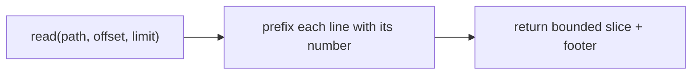

# Read: Numbered Lines and Bounded Ranges

> **Motto** — The agent can only edit what it can point at, so every read returns numbered lines and a bounded slice.

*Part of Phase 05 — Files and Shell.*

*Last reviewed: 2026-10 · Volatility: fast*

## The Problem

An agent must read code before it changes code. A 5,000-line file read whole fills the context budget (see [Context Budget](../../../03-context-and-memory/01-context-budget/docs/en.md)). It also gives the model no way to name a place. Without line numbers the model says "the function near the top", and the next edit guesses.

A read tool has two jobs. It must label every line, so the model can cite `path:line`. It must also cap the slice, so one call cannot swallow the budget. The tool must fail with plain text, because a Python traceback tells the model nothing.

## The Concept



Line numbers make a file addressable. Offset and limit bound the cost. A footer such as `[showing lines 5-7 of 20; call read with offset=8]` tells the model how to continue. The model then pages through a file on purpose instead of by accident.

Three guards keep the tool safe. It cuts very long lines, because one minified line can hold a whole bundle. It refuses binary files. It reports a missing file or a bad offset as an error string.

## Build It

`code/read_tool.py` holds the whole tool. This is the function:

```python
def read(path, offset=1, limit=2000, max_line_chars=200):
    """Return lines [offset, offset+limit) with 1-based line numbers.

    Long lines are cut with a marker. A footer tells the model how to continue.
    """
    if not os.path.isfile(path):
        return f"error: no such file: {path}"
    with open(path, "rb") as f:
        if b"\0" in f.read(8192):
            return f"error: {path} looks binary; read refused"
    with open(path, encoding="utf-8", errors="replace") as f:
        lines = f.read().splitlines()
    total = len(lines)
    if total == 0:
        return f"(file exists but is empty: {path})"
    if offset > total:
        return f"error: offset {offset} is past the end ({total} lines)"
    start = max(0, offset - 1)
    end = min(total, start + limit)
    width = len(str(end))
    out = []
    for i in range(start, end):
        text = lines[i]
        if len(text) > max_line_chars:
            text = text[:max_line_chars] + f"...[line cut, {len(lines[i])} chars]"
        out.append(f"{i + 1:>{width}}  {text}")
    if end < total:
        out.append(f"[showing lines {start + 1}-{end} of {total}; call read with offset={end + 1}]")
    return "\n".join(out)
```

The numbers are real file positions. Line 5 stays "5" even when the slice starts there. The footer is part of the result, so the model sees the next offset in the same message.

The file ends with asserts. They check the numbering, the footer text, the long-line cut, and the three error paths. Run it with `python3 code/read_tool.py`.

## Use It

Claude Code ships a **Read** tool with the same idea. It returns file contents with line numbers. When a whole-file read passes the token limit, Read returns the first page with a `PARTIAL view` notice. The notice tells Claude how much it got and how to read more with `offset` and `limit`.

Two more facts matter for your own harness. A partial read does not count as "read" for the read-before-edit rule (the next lesson). And Read handles images, PDFs and Jupyter notebooks, not only text. Read only opens files. To list a directory, Claude uses a shell command such as `ls`.

Permission rules can target reads. A deny rule such as `Read(./.env)` blocks the file tools from that path. See [Settings.json](../../../06-permissions-and-security/03-settings-json/docs/en.md).

## Challenge

Run your `read` on a minified file, then ask the model to edit text inside the cut part of a line. The exact-string edit in the next lesson needs the full line. Decide how the harness should let the model fetch the hidden part. Write the fix and an assert for it.

## Sources

Claude Code docs, "Tools reference", section "Read tool behavior" (code.claude.com/docs/en/tools-reference).

Next: [Edit, Write and Patch](../../02-edit-write-and-patch/docs/en.md)
