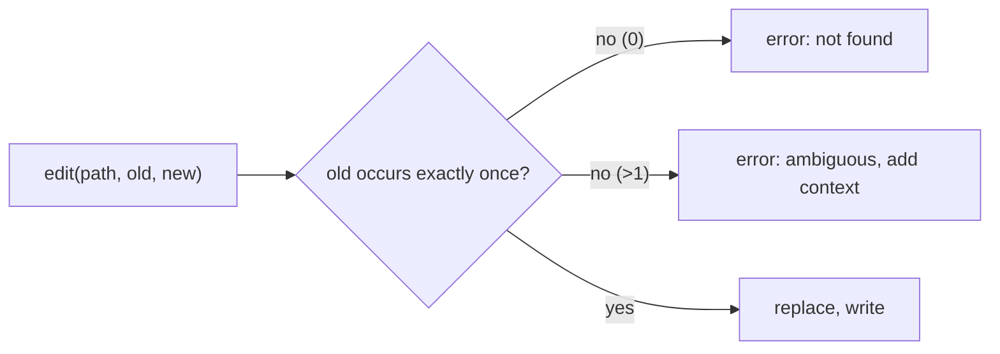

# Edit, Write and Patch: Change Files Safely

> **Motto** — Change a file by replacing one exact string, and never overwrite what the agent has not seen.

*Part of Phase 05 — Files and Shell.*

*Last reviewed: 2026-10 · Volatility: fast*

## The Problem

The lazy way to edit is to ask the model for the whole new file. That is slow and costs many tokens. It is also risky. The model can drop a function or reformat code it should not touch.

Three rules fix this. Edit by replacing one exact string. Overwrite a file only after the agent has read it. Apply a multi-file change as one unit, so a failure leaves nothing half done.

## The Concept



Uniqueness is the safety property. If `old` matches twice, the tool refuses and asks for more context. It never guesses a spot.

Reading is the second gate. The harness records a digest of each file at read time. An edit needs a prior read. A write to an existing file needs a read and an unchanged digest. New files need neither.

A patch is a list of `(path, old, new)` hunks. The tool checks every hunk against staged text first. It writes only if all hunks pass.

## Build It

`code/edit_tool.py` holds one `Workspace` class. Each write goes to a temp file and then `os.replace`, so a crash never leaves a half-written file.

```python
def _write_atomic(path, text):
    """Write to a temp file in the same folder, then rename over the target."""
    fd, tmp = tempfile.mkstemp(dir=os.path.dirname(os.path.abspath(path)))
    with os.fdopen(fd, "w") as f:
        f.write(text)
    os.replace(tmp, path)


class Workspace:
    def __init__(self):
        self.seen = {}                       # abs path -> digest at last read

    def read(self, path):
        with open(path) as f:
            text = f.read()
        self.seen[os.path.abspath(path)] = _digest(text)
        return text

    def edit(self, path, old, new, replace_all=False):
        ap = os.path.abspath(path)
        if ap not in self.seen:
            return "error: read the file before you edit it"
        with open(ap) as f:
            text = f.read()
        n = text.count(old)
        if n == 0:
            return "error: old_string not found"
        if n > 1 and not replace_all:
            return f"error: old_string matches {n} times; add surrounding context"
        _write_atomic(ap, text.replace(old, new))
        self.seen[ap] = _digest(text.replace(old, new))
        return f"ok: {n if replace_all else 1} replacement(s)"

    def write(self, path, content):
        ap = os.path.abspath(path)
        if os.path.exists(ap):
            if ap not in self.seen:
                return "error: file exists and was not read this session"
            with open(ap) as f:
                if _digest(f.read()) != self.seen[ap]:
                    return "error: file changed since you read it; read it again"
        _write_atomic(ap, content)
        self.seen[ap] = _digest(content)
        return "ok: wrote " + path

    def apply_patch(self, hunks):
        """hunks: [(path, old, new)]. Validate every hunk, then write all or none."""
        staged = {}
        for path, old, new in hunks:
            ap = os.path.abspath(path)
            if ap not in self.seen:
                return f"reject: {path} was not read"
            if ap not in staged:
                with open(ap) as f:
                    staged[ap] = f.read()
            n = staged[ap].count(old)
            if n != 1:
                return f"reject: hunk for {path} matches {n} times (need 1); nothing written"
            staged[ap] = staged[ap].replace(old, new)
        for ap, text in staged.items():      # reached only if every hunk passed
            _write_atomic(ap, text)
            self.seen[ap] = _digest(text)
        return f"applied {len(hunks)} hunk(s) in {len(staged)} file(s)"
```

Look at `apply_patch`. It stages text in memory, so a second hunk on the same file sees the first hunk's result. The disk is touched only in the last loop. If hunk three fails, hunks one and two never wrote.

The file ends with asserts. They prove that an unread edit fails, that an ambiguous match fails, that a clobbering write leaves the file unchanged, and that a bad hunk leaves both files untouched. Run `python3 code/edit_tool.py`.

## Use It

Claude Code has an **Edit** tool and a **Write** tool. Edit does exact string replacement. It uses no regex and no fuzzy match. A single changed space makes it miss.

The documented checks match this lesson. The file must have been read in the conversation, and a read cut short by a `PARTIAL view` notice does not count. `old_string` must appear exactly once, or Claude sets `replace_all: true`. Newer models may edit an unread file when reading it would need no permission prompt. Older models always need the read.

Write creates a file or replaces it whole. The same read rule applies to existing files, and new files are exempt. For a partial change, Claude uses Edit.

The docs do not describe an atomic multi-file patch tool. Treat `apply_patch` as your own design for review and rollback. Path rules use `Edit(path)`, so one rule covers every built-in tool that edits files. See [Settings.json](../../../06-permissions-and-security/03-settings-json/docs/en.md).

## Challenge

Make `apply_patch` return a unified diff of the staged changes without writing anything (Python's `difflib.unified_diff` helps). Add a `dry_run=True` flag. Assert that a dry run leaves every file unchanged.

## Sources

Claude Code docs, "Tools reference", sections "Edit tool behavior" and "Write tool behavior" (code.claude.com/docs/en/tools-reference).

Next: [Search](../../03-search/docs/en.md)
