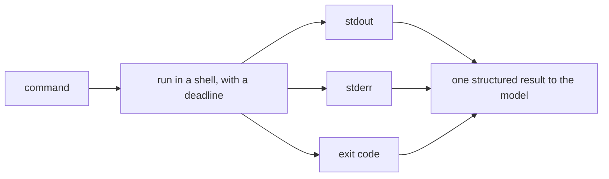

# Bash: Capture Everything and Set a Deadline

> **Motto** — A command gives three signals (stdout, stderr, exit code) and needs a deadline, or one hung process stalls the agent.

*Part of Phase 05 — Files and Shell.*

*Last reviewed: 2026-10 · Volatility: fast*

## The Problem

The Bash tool is the agent's strongest tool. It runs tests and builds. It can also run `rm -rf`. The safety side comes later. This lesson covers the first two needs.

First, the model must see the full result. stderr often holds the error. The exit code is the only reliable pass or fail signal. An agent that sees only stdout may call a failed build a success.

Second, a command can hang. A test may wait for input. A server may never exit. Without a deadline the whole session stalls.

## The Concept



Exit code 0 means success. Any other code means failure. The result block puts the status first, so failure is hard to miss.

A deadline needs a real kill. A shell command may start children. If you kill only the shell, the children live on. So the tool starts the command in its own **process group** and kills the whole group on expiry.

Output needs a cap too. Keep the head and the tail of long output. The start shows what ran. The end shows how it failed.

## Build It

`code/bash_tool.py` has `run` and `format_result`:

```python
def run(command, cwd=None, timeout=10):
    proc = subprocess.Popen(
        command, shell=True, cwd=cwd, text=True,
        stdin=subprocess.DEVNULL,                     # a command that waits for input gets EOF
        stdout=subprocess.PIPE, stderr=subprocess.PIPE,
        start_new_session=True)                       # own process group
    try:
        out, err = proc.communicate(timeout=timeout)
        return {"exit_code": proc.returncode, "stdout": out, "stderr": err, "timed_out": False}
    except subprocess.TimeoutExpired:
        os.killpg(proc.pid, signal.SIGKILL)           # kill the shell AND its children
        out, err = proc.communicate()
        return {"exit_code": -1, "stdout": out or "", "stderr": (err or "") + f"\ntimeout after {timeout}s",
                "timed_out": True}


def format_result(r, max_chars=400):
    """One block for the model. Exit code first. Keep the head and the tail of long output."""
    body = r["stdout"] + (("\n[stderr]\n" + r["stderr"]) if r["stderr"].strip() else "")
    if len(body) > max_chars:
        half = max_chars // 2
        cut = len(body) - max_chars
        body = body[:half] + f"\n...[{cut} chars cut]...\n" + body[-half:]
    status = "TIMEOUT" if r["timed_out"] else f"exit={r['exit_code']}"
    return f"{status}\n{body}".rstrip()
```

`start_new_session=True` gives the command its own group, so `os.killpg` reaches every child. `stdin=DEVNULL` makes a command that waits for input read end-of-file at once, so it cannot hang.

The asserts check each part. They capture all three signals. They start `sleep 30 &`, hit the deadline, and then check that the child process is gone. They also check that long output keeps both ends. Run `python3 code/bash_tool.py`.

## Use It

Claude Code's **Bash** tool has the same three parts, with some differences.

**Timeout.** The default is two minutes and the ceiling is ten minutes. The variables are `BASH_DEFAULT_TIMEOUT_MS` and `BASH_MAX_TIMEOUT_MS`. Claude passes a `timeout` on a call when it needs more. A foreground command that hits its timeout is not killed. Claude Code moves it to the background, unless the command starts with `sleep`. The [next lesson](../../05-background-jobs-and-shell-state/docs/en.md) covers background jobs.

**Output.** A valid result arrives inline up to about 30,000 characters. Past that, Claude gets a file path and a preview of the first 2,000 characters. A failure result keeps about 10,000 characters as a head and tail excerpt.

**Exit codes.** Exit code 1 counts as success for commands such as `grep`, `rg`, `find`, `diff`, `test` and `git diff`, because it means "no match" or "differs". Any other command that exits 1 counts as a failure. Your harness may need the same table.

## Challenge

Change the kill to a gentler sequence. Send `SIGTERM` to the group, wait one second, then send `SIGKILL`. Write a command that traps `SIGTERM` and cleans up a file. Assert that the file is cleaned up.

## Sources

Claude Code docs, "Tools reference", section "Bash tool behavior" (code.claude.com/docs/en/tools-reference).

Next: [Background Jobs and Shell State](../../05-background-jobs-and-shell-state/docs/en.md)
