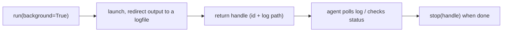

# Background Jobs and Shell State

> **Motto** — A dev server must not block the agent, and a `cd` must not vanish between calls.

*Part of Phase 05 — Files and Shell.*

*Last reviewed: 2026-10 · Volatility: fast*

## The Problem

Two bugs hit every shell tool.

First, some commands should run for a long time. A dev server, a file watcher and a `tail` never exit on their own. A foreground call would block the loop. A timeout would kill them, and you want them alive.

Second, the agent runs `cd backend` and then `npm test`. The test runs in the wrong folder. A harness that uses one `subprocess.run` per call starts a new shell each time. It loses the working directory (cwd) and every `export`.

## The Concept



A background job returns a handle at once. Output goes to a log file. The agent polls the log, waits for a ready line such as `Listening on`, and stops the job at the end.

Shell state has two parts, and they behave differently in Claude Code. The cwd carries over between calls, if it stays inside the project. Environment variables do not carry over. A harness must decide each part on purpose.

## Build It

`code/background.py` is a small job manager. `stop` signals the whole process group, because a shell may hold children.

```python
class BackgroundJobs:
    def __init__(self):
        self.jobs = {}                                    # id -> (proc, logpath)
        self._next = 1

    def start(self, command):
        fd, log = tempfile.mkstemp(suffix=".log")
        with os.fdopen(fd, "w") as f:                     # the child keeps its own copy of the fd
            proc = subprocess.Popen(command, shell=True, stdin=subprocess.DEVNULL,
                                    stdout=f, stderr=subprocess.STDOUT, start_new_session=True)
        job_id = f"job{self._next}"
        self._next += 1
        self.jobs[job_id] = (proc, log)
        return {"id": job_id, "pid": proc.pid, "log": log}

    def output(self, job_id):
        with open(self.jobs[job_id][1]) as f:
            return f.read()

    def status(self, job_id):
        proc = self.jobs[job_id][0]
        return "running" if proc.poll() is None else f"exited({proc.returncode})"

    def wait_for(self, job_id, pattern, timeout=5):
        """Block until a log line matches pattern (for example 'Listening on')."""
        end = time.time() + timeout
        while time.time() < end:
            if re.search(pattern, self.output(job_id)):
                return True
            if self.status(job_id) != "running":
                return bool(re.search(pattern, self.output(job_id)))
            time.sleep(0.05)
        return False

    def stop(self, job_id):
        proc = self.jobs[job_id][0]
        if proc.poll() is None:
            os.killpg(proc.pid, signal.SIGTERM)           # the whole group, not only the shell
            try:
                proc.wait(timeout=2)
            except subprocess.TimeoutExpired:
                os.killpg(proc.pid, signal.SIGKILL)
                proc.wait()
        return self.status(job_id)
```

`code/shell_session.py` keeps the cwd and drops the env. It sets a shell `EXIT` trap that writes the final directory to a file. This works for `cd src && make`, which a "does the command start with `cd`" check would miss. A `cd` outside the project is undone with a note. An optional `env_file` is sourced before every call, so chosen variables persist.

```python
class ShellSession:
    def __init__(self, project_dir, env_file=None):
        self.root = os.path.realpath(project_dir)
        self.cwd = self.root
        self.env_file = env_file            # sourced before every command (like CLAUDE_ENV_FILE)

    def run(self, command, timeout=10):
        fd, state = tempfile.mkstemp()
        os.close(fd)
        script = f"trap 'pwd -P > {state}' EXIT\n"        # record where the command ended
        if self.env_file:
            script += f". {self.env_file}\n"
        script += command + "\n"
        p = subprocess.run(["bash", "-c", script], cwd=self.cwd, capture_output=True,
                           text=True, timeout=timeout, stdin=subprocess.DEVNULL)
        with open(state) as f:
            end = f.read().strip()
        os.remove(state)
        note = ""
        if end == self.root or end.startswith(self.root + os.sep):
            self.cwd = end                                # cd inside the project sticks
        else:
            self.cwd = self.root                          # cd outside the project is undone
            note = f"\nShell cwd was reset to {self.root}"
        return {"exit_code": p.returncode, "stdout": p.stdout + note, "stderr": p.stderr}
```

Both files end with asserts. The jobs file checks that `start` does not block, that `wait_for` can fail, that `stop` ends the group, and that a failing job reports its exit code. The session file checks that a plain `subprocess.run` loses the cwd, that `export` is lost, and that the env file survives.

## Use It

Claude Code's **Bash** tool behaves like this session. Verified from the docs:

- A `cd` in the main session carries over to later Bash commands while it stays inside the project or an added directory. Outside, Claude Code resets to the project directory and appends `Shell cwd was reset to <dir>`.
- Subagent sessions never carry over cwd changes.
- `export` does not persist. To keep variables, point `CLAUDE_ENV_FILE` at a shell script, or fill it from a `SessionStart` hook.
- Aliases and functions from your shell startup file are available.

For background work, Claude sets `run_in_background: true`. In unattended runs (`-p`, the Agent SDK, CI, cloud), a background command has a 30-minute limit by default and 2 hours at most. A local interactive session has no such limit (v2.1.288 and later; earlier versions applied it everywhere). List and stop tasks with `/tasks`. A `cd` inside a backgrounded command never applies to later commands.

## Challenge

Add a `restart(job_id)` to `BackgroundJobs` that stops a job and starts the same command again. Assert that the new job has a new id, a new log, and a fresh PID. Then say when a harness should refuse a restart, for example after a crash loop.

## Sources

Claude Code docs, "Tools reference", sections "What persists between commands" and "Background commands" (code.claude.com/docs/en/tools-reference).

Next: [Sandbox and Egress](../../06-sandbox-and-egress/docs/en.md)
