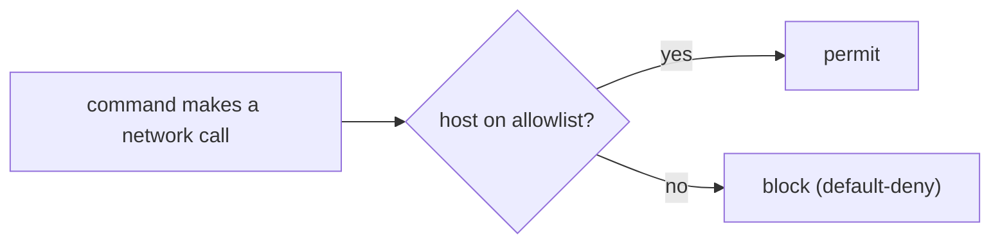

# Sandbox and Egress: Limits, Allowlists, and Honest Gaps

> **Motto** — Decide what the agent may reach before it runs, and know exactly what each layer does not stop.

*Part of Phase 05 — Files and Shell.*

*Last reviewed: 2026-10 · Volatility: fast*

## The Problem

A misled agent can call home. It can POST your source or secrets to an attacker, which is the usual payoff of prompt injection (see [Untrusted Content](../../../06-permissions-and-security/04-untrusted-content/docs/en.md)). File rules do not stop that. You need **egress control**: a list of hosts the commands may reach, with everything else denied.

A first guard is easy to write and easy to beat. This lesson builds a better one. It also shows the cheapest resource limits, and it says plainly what they do not do.

## The Concept



Default-deny is the rule. Name the few hosts you need. Block the rest, including what you cannot read.

Text checks fail in a known way. A regex for `https://` URLs misses `curl evil.test`, `nc host`, `sh -c '...'`, `$(...)` and `/dev/tcp`. So the guard must **parse** the command. It splits compound commands. It unwraps `sh -c`, `eval`, `sudo`, `env` and `timeout`. It finds every network-capable program. It checks every host argument. It denies any argument it cannot verify, such as `$HOST`.

Resource limits are a different layer. They cap CPU, memory and file size. They do not hide files and they do not close the network.

## Build It

`code/egress_guard.py` first keeps the old guard, to show the bug:

```python
def naive_guard(command):
    """The old guard: only looks at http(s):// URLs. Kept to show what it misses."""
    for host in re.findall(r"https?://([a-zA-Z0-9.-]+)", command):
        if host not in ALLOWED_HOSTS:
            return False
    return True
```

The new guard checks every argument of a network tool, and it fails closed:

```python
def _check_hosts(prog, args, allow):
    found, skip_next = [], False
    for a in args:
        if skip_next:
            skip_next = False
            continue
        if a in DATA_FLAGS:
            skip_next = True
            continue
        if a.startswith("-") and "=" not in a:
            continue
        value = a.split("=", 1)[1] if a.startswith("-") else a
        if re.search(r"[$`*~{}]", value):
            return f"{prog} argument {value!r} cannot be verified (shell expansion)"
        if re.fullmatch(r"\d{1,5}", value):
            continue                                   # a port number
        found.append(host_of(value))
    for h in found:
        if h not in allow:
            return f"{prog} reaches {h or value!r}, which is not allowlisted"
    if not found:
        return f"{prog} names no allowlisted host (default deny)"
    return None
```

```python
def check(command, allow=ALLOWED_HOSTS):
    """Return (True, "") to allow or (False, reason) to block."""
    reason = _check(command, allow)
    return (reason is None, reason or "")
```

The asserts try 37 bypasses. They include a bare host, a `user@host` trick, `github.com.evil.test`, a proxy flag, `/dev/tcp`, and a base64 pipe into `sh`. All are blocked. The old guard allows `curl evil.test`, and the file asserts that too.

`code/sandbox_limits.py` applies `setrlimit` limits and a stripped environment:

```python
def run_limited(command, workdir, cpu_seconds=2, max_mem_mb=256, max_file_mb=1, timeout=10):
    def set_limits():
        resource.setrlimit(resource.RLIMIT_CPU, (cpu_seconds, cpu_seconds))
        mem = max_mem_mb * 1024 * 1024
        resource.setrlimit(resource.RLIMIT_AS, (mem, mem))
        size = max_file_mb * 1024 * 1024
        resource.setrlimit(resource.RLIMIT_FSIZE, (size, size))

    env = {"PATH": os.path.dirname(sys.executable) + ":/usr/bin:/bin", "HOME": workdir}
    proc = subprocess.Popen(command, shell=True, cwd=workdir, env=env, text=True,
                            stdin=subprocess.DEVNULL, stdout=subprocess.PIPE,
                            stderr=subprocess.PIPE, preexec_fn=set_limits,
                            start_new_session=True)
    try:
        out, err = proc.communicate(timeout=timeout)
    except subprocess.TimeoutExpired:
        os.killpg(proc.pid, signal.SIGKILL)
        out, err = proc.communicate()
        return {"exit_code": -1, "stdout": out, "stderr": err + "timeout"}
    return {"exit_code": proc.returncode, "stdout": out, "stderr": err}
```

Its asserts prove the limits work. They also prove the limits are thin: the child can still read files outside its folder and open a socket. Run both files with `python3 code/<file>.py`.

## Use It

`outputs/egress_guard_hook.py` wraps the guard as a Claude Code `PreToolUse` hook. It reads the hook JSON, checks `tool_input.command`, and exits 2 to block. It was run against sample hook input. Its limits are plain. It reads command text. It cannot see inside `python3 fetch.py`. Do not rely on it alone.

Claude Code's docs say the same about permission rules. A rule such as `Bash(curl *)` does not stop `/usr/bin/curl` or `sh -c 'curl ...'`. A rule is not a security boundary. The docs point to the sandbox for that.

The built-in **sandbox** is an operating-system boundary around Bash commands. It uses Seatbelt on macOS, and `bubblewrap` plus `socat` on Linux and WSL2. It is off by default. Turn it on with `/sandbox` or `sandbox.enabled`. By default, commands can write to the working directory and temp. They can still read most of the machine, including `~/.ssh`. Network goes through a proxy that checks `network.allowedDomains`, which starts empty. Environment variables are inherited unless you set `credentials` or `CLAUDE_CODE_SUBPROCESS_ENV_SCRUB`.

```json
{"sandbox": {"enabled": true, "network": {"allowedDomains": ["github.com", "*.npmjs.org"]}}}
```

The sandbox covers shell commands only. Read, Edit, Write, hooks and local MCP servers run outside it. Containers, namespaces and seccomp are what a stronger setup adds. This lesson has no code for them.

## Challenge

Extend the guard to resolve names. Given a resolver function you pass in, block a host whose address is private (`127.0.0.0/8`, `10.0.0.0/8`, `169.254.0.0/16`) even if the name is allowlisted. Assert that an allowlisted name that resolves to `127.0.0.1` is blocked.

## Sources

Claude Code docs: "Configure the sandboxed Bash tool" and "Configure permissions", section "What a Bash rule doesn't match" (code.claude.com/docs/en).

Next: [Permission Gate](../../../06-permissions-and-security/01-permission-gate/docs/en.md)
