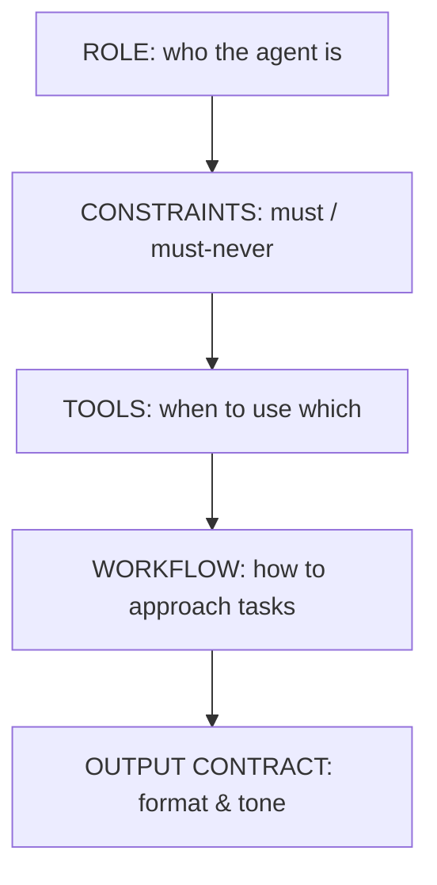

# Anatomy of a system prompt

> **Motto** — The system prompt is the agent's constitution: role, rules, tools, and output contract.

*Part of Phase 05 — Prompt & Instruction Architecture.*

## The Problem

The system prompt is the highest-authority, most-cached, most-reused text in the harness
(Phase 1 lesson 06, Phase 4 lesson 06). A vague one produces an agent that ignores
constraints, picks the wrong tools, and formats output unpredictably. A bloated one wastes
the cached prefix and buries the rules that matter. You need a structure — known sections,
in a stable order.

## The Concept

Five sections, ordered stable→specific so the prefix caches well: role, hard constraints,
tool guidance, workflow, output contract.

## Build It

The artifact is a structured template, not code. `outputs/system-prompt-template.md` lays
out the five sections with fill-ins and notes on what belongs where (and what doesn't —
volatile data never goes here; it kills caching).

Key rules encoded in the template:

- **Role** in one or two sentences; concrete, not flowery.
- **Constraints** as imperatives ("Never edit `.env`. Always run tests before claiming
  done.") — these are the lines the model must obey.
- **Tools**: when to reach for each, when *not* to (overlap disambiguation, Phase 3 L6).
- **Workflow**: the default approach (e.g. plan → act → verify).
- **Output contract**: format, length, tone — the response shape downstream code expects.

## Use It

This *is* the system prompt that **Claude Code / Codex** ship — plus your additions. The
parts you control are layered in through project memory (`CLAUDE.md` / `AGENTS.md`, next
lesson) and output styles. Knowing the anatomy tells you where your instruction belongs: a
hard rule goes in constraints (and ideally becomes a hook, Phase 8), a formatting
preference goes in the output contract.

## Ship It

[`outputs/system-prompt-template.md`](../../01-system-prompt-anatomy/outputs/system-prompt-template.md)
— a five-section system-prompt template.

## Check Yourself

**Q1.** Why keep volatile data out of the system prompt?

- A) it's untidy
- B) the system prompt is the cached prefix; changing it invalidates the cache (Phase 1 L8)
- C) the API forbids it
- D) no reason

Answer
B — stable system prompt = cache hits.

**Q2.** A hard rule like "never edit .env" belongs in…

- A) the output contract
- B) the constraints section (and ideally also a hook)
- C) the workflow
- D) a user message

Answer
B — constraints carry the must/must-never
rules.

**Challenge.** Take a rambling system prompt and refactor it into the five sections; note
which lines were redundant and could be deleted.

## Related

- Builds on: Phase 1 — [Roles & precedence](../../../01-llm-io-foundations/06-roles-precedence/docs/en.md)
- Next: [Memory files (CLAUDE.md / AGENTS.md)](../../02-memory-files/docs/en.md)
- [Roadmap](../../../../ROADMAP.md)
