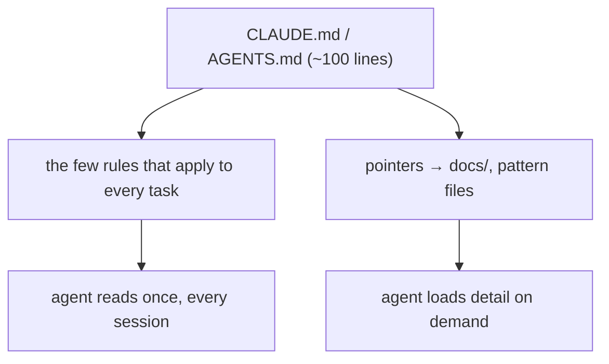

# Memory Files (CLAUDE.md / AGENTS.md)

> **Motto** — A memory file is a short, stable table of contents — not an encyclopedia.

*Part of Phase 05 — Prompt & Instruction Architecture.*

## The Problem

`CLAUDE.md` (Claude Code) and `AGENTS.md` (Codex) are how *you* inject durable, project-
specific instructions into every turn. The failure mode is predictable: the file grows
into a 2,000-line manual, the agent stops absorbing it, you stop maintaining it, and it
crowds the cached prefix. A good memory file is short and points to detail rather than
inlining it (the legibility principle from harness foundations).

## The Concept

Keep the root file ~100 lines: the handful of always-true rules plus links to deeper docs.
Detail lives one hop away, loaded only when needed.

## Build It

The artifact is a memory-file skill/template. `outputs/CLAUDE.md.template` gives a lean
structure: project one-liner, build/test commands, hard conventions, and a pointer list to
`docs/`. The same content works as `AGENTS.md` for Codex.

What belongs in it:
- **Commands** the agent will need (how to run tests, lint, build).
- **Conventions** that are non-obvious and recurring (import discipline, naming).
- **Pointers** to deeper docs, not the docs themselves.

What doesn't: anything volatile, anything restated from the system prompt, anything you
wouldn't re-read.

## Use It

Drop the file at the repo root as `CLAUDE.md` (Claude Code) or `AGENTS.md` (Codex) and
both tools load it automatically each session. When the agent repeats a mistake, resist
adding a paragraph — encode the fix as a lint rule or hook (Phase 8) and keep the memory
file lean (patch the harness, not the prompt).

## Ship It

[`outputs/CLAUDE.md.template`](../../02-memory-files/outputs/CLAUDE.md.template) — a lean
project-memory file that doubles as `AGENTS.md`.

## Check Yourself

**Q1.** How long should a root memory file be?

- A) as long as possible
- B) short (~100 lines) — a table of contents pointing to detail
- C) one line
- D) it doesn't matter

Answer
B — lean and pointer-based; detail lives one hop
away.

**Q2.** The agent keeps making the same mistake. Best fix?

- A) add a paragraph to CLAUDE.md
- B) encode the fix as a lint rule / hook and keep the memory file lean
- C) a bigger model
- D) repeat the rule three times

Answer
B — patch the harness, not the prompt.

**Challenge.** Write a `CLAUDE.md` for a real repo of yours in under 100 lines, with at
least three pointers to `docs/` instead of inlined detail.

## Related

- Builds on: [System prompt anatomy](../../01-system-prompt-anatomy/docs/en.md)
- Next: [Steering: tone, refusals & guardrail text](../../03-steering/docs/en.md)
- Deepens in: Phase 9 — Memory & Persistence
- [Roadmap](../../../../ROADMAP.md)
