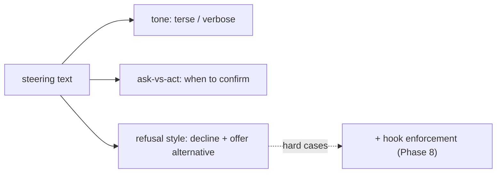

# Steering: Tone, Refusals & Guardrail Text

> **Motto** — Steering is the prompt text that shapes *how* the agent responds and *when* it declines.

*Part of Phase 05 — Prompt & Instruction Architecture.*

## The Problem

Beyond what the agent does, you control *how* it communicates: terse vs. explanatory,
when it refuses or asks for confirmation, and how it phrases guardrails. Weak steering
gives you an agent that over-explains, barrels through risky actions without asking, or
refuses unhelpfully. Steering text is the lever — but it's only persuasion, so it pairs
with hard enforcement (hooks, Phase 8) for anything that truly matters.

## The Concept

Steering shapes the *soft* behavior; for safety-critical limits, steering is the polite
front and a hook is the wall behind it.

## Build It

The artifact is a steering snippet library. `outputs/steering-snippets.md` provides
reusable lines for tone, ask-vs-act thresholds, and refusal phrasing, e.g.:

- **Tone:** "Be terse. No preamble or postamble. Lead with the answer."
- **Ask-vs-act:** "Make reversible changes directly. Before irreversible or out-of-scope
  actions, state a one-line plan and wait for confirmation."
- **Refusal:** "If you can't or shouldn't do something, say so in one sentence and offer
  the nearest safe alternative."

Each snippet is a line you can paste into the system prompt or memory file.

## Use It

In **Claude Code / Codex** this maps to output styles and your memory-file instructions
("be concise", "always confirm before deleting files"). Crucially: steering is advisory.
For "never touch `.env`" you *also* add the PreToolUse hook from Phase 0/8 — the steering
text explains the boundary, the hook enforces it.

## Ship It

[`outputs/steering-snippets.md`](../../03-steering/outputs/steering-snippets.md) — reusable
tone / ask-vs-act / refusal lines.

## Check Yourself

**Q1.** Steering text alone is sufficient to enforce a safety-critical rule.

- A) true
- B) false — it's persuasion; pair it with a hook for hard enforcement
- C) true if the model is large
- D) true at temperature 0

Answer
B — steering shapes soft behavior; hooks enforce.

**Q2.** A good refusal…

- A) just says "no"
- B) declines in one sentence and offers the nearest safe alternative
- C) ignores the request
- D) explains at length

Answer
B — brief, with a constructive alternative.

**Challenge.** Write an ask-vs-act rule that classifies three example actions (rename a
local var, delete a file, push to main) into act-directly vs. confirm-first.

## Related

- Builds on: [System prompt anatomy](../../01-system-prompt-anatomy/docs/en.md)
- Next: [Output styles & response contracts](../../04-output-contracts/docs/en.md)
- Enforced by: Phase 8 — Permissions & hooks
- [Roadmap](../../../../ROADMAP.md)
