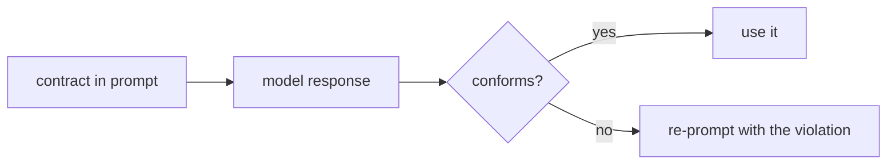

# Output styles & response contracts

> **Motto** — State the output contract, then verify the output meets it — don't just hope.

*Part of Phase 05 — Prompt & Instruction Architecture.*

## The Problem

You ask the agent for a specific shape — "a summary, then a bullet list of changed files,
then the diff" — and most of the time you get it. "Most of the time" breaks downstream
automation. A response *contract* is the format stated in the prompt **plus** a check in
the harness that the response conforms, so violations are caught (and can trigger a
repair) instead of silently flowing through.

## The Concept



The prompt states the contract; the harness enforces it. This is the structured-output
idea (Phase 1 L7) generalized from JSON to any response shape.

## Build It

`code/contract.py` — declare required sections and verify a response:

```python
import re

def check_contract(text, required_sections, max_chars=None):
    problems = []
    for heading in required_sections:
        if not re.search(rf"^#+\s*{re.escape(heading)}", text, re.MULTILINE | re.IGNORECASE):
            problems.append(f"missing section: {heading}")
    if max_chars and len(text) > max_chars:
        problems.append(f"too long: {len(text)} > {max_chars} chars")
    return problems            # empty list == conforms

def repair_prompt(problems):
    return ("Your previous response did not meet the format contract:\n- "
            + "\n- ".join(problems) + "\nReformat to satisfy all requirements.")
```

```python
resp = "## Summary\nDid the thing.\n## Files\n- a.py"
print(check_contract(resp, ["Summary", "Files", "Diff"]))
# ['missing section: Diff']
```

A non-empty problem list feeds `repair_prompt`, which you send back to the model — bounded
by your retry budget (Phase 14).

## Use It

In **Claude Code / Codex** this maps to **output styles** (declare the response format
once) plus your own verification when the response feeds a script. For human-facing chat,
the prompt contract is usually enough; for machine-consumed output, add the check — and
prefer tool-schema output (Phase 3 L7) when the shape is strict.

## Ship It

[`code/contract.py`](../../04-output-contracts/code/contract.py) — a response-contract checker
+ repair-prompt builder.

## Check Yourself

**Q1.** A response contract is…

- A) just a prompt instruction
- B) the format in the prompt PLUS a harness check that the output conforms
- C) a tool
- D) a model setting

<details><summary>Answer</summary>B — state it and verify it.</details>

**Q2.** When the output feeds a downstream script, you should…

- A) trust the prompt
- B) verify the contract (or use tool-schema output) and repair on violation
- C) lower temperature only
- D) ask twice

<details><summary>Answer</summary>B — machine-consumed output needs enforcement.</details>

**Challenge.** Extend `check_contract` to require sections in a specific *order*, not just
presence.

## Related

- Builds on: Phase 1 — [Structured output](../../../01-llm-io-foundations/07-structured-output/docs/en.md)
- Next: [Few-shot & in-context examples](../../05-few-shot/docs/en.md)
- [Roadmap](../../../../ROADMAP.md)
