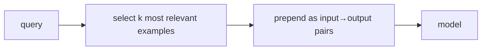

# Few-shot & in-context examples that scale

> **Motto** — A couple of well-chosen examples teach format and edge cases better than paragraphs of rules.

*Part of Phase 05 — Prompt & Instruction Architecture.*

## The Problem

Sometimes prose instructions don't land a tricky format or an edge case, and the fix is to
*show* the model: a few input→output examples. But examples cost tokens, and dumping ten of
them bloats the prompt and the cached prefix. The skill is selecting a *small, relevant*
set — and, when you have many, picking dynamically per query rather than always sending all.

## The Concept



Two regimes: a fixed handful (2–3) baked into the prompt for a stable task, or dynamic
selection of the top-k examples by similarity to the current input when you have a library.

## Build It

`code/few_shot.py` — a simple selector + formatter (lexical overlap stands in for embeddings,
which arrive in Phase 13):

```python
def select(examples, query, k=2):
    def overlap(ex):
        a, b = set(ex["input"].lower().split()), set(query.lower().split())
        return len(a & b)
    return sorted(examples, key=overlap, reverse=True)[:k]

def format_fewshot(examples, query):
    shots = "\n\n".join(f"Input: {e['input']}\nOutput: {e['output']}" for e in examples)
    return f"{shots}\n\nInput: {query}\nOutput:"
```

```python
ex = [{"input": "add user route", "output": "POST /users"},
      {"input": "delete a product", "output": "DELETE /products/:id"},
      {"input": "list orders", "output": "GET /orders"}]
picked = select(ex, "add product route", k=2)
print(format_fewshot(picked, "add product route"))
```

Selecting the two nearest examples keeps the prompt small while still teaching the pattern.

## Use It

In **Claude Code / Codex**, you rarely hand-write few-shot blocks — instead you put a
canonical example in `CLAUDE.md`/`AGENTS.md` (e.g. "a route looks like this") so it's
applied every turn, and the agent generalizes. The dynamic-selection version is what you
build when a skill needs to choose examples per request. Keep examples few and relevant:
more isn't better once the pattern is clear.

## Ship It

[`code/few_shot.py`](../../05-few-shot/code/few_shot.py) — top-k example selection +
formatting.

## Check Yourself

**Q1.** Why not always include all your examples?

- A) the API caps them
- B) they cost tokens and bloat the cached prefix; a few relevant ones suffice
- C) examples hurt accuracy
- D) no reason

<details><summary>Answer</summary>B — small and relevant beats many.</details>

**Q2.** For a stable, recurring format in your project, the best place for an example is…

- A) every user message
- B) the memory file (CLAUDE.md / AGENTS.md), applied every turn
- C) a separate API
- D) nowhere

<details><summary>Answer</summary>B — bake the canonical example into project memory.</details>

**Challenge.** Swap the lexical overlap for an embedding similarity (forward reference to
Phase 13) and compare which examples each picks.

## Related

- Builds on: [Output contracts](../../04-output-contracts/docs/en.md)
- Next: [Prompt versioning & A/B](../../06-prompt-versioning/docs/en.md)
- Deepens in: Phase 13 — Retrieval
- [Roadmap](../../../../ROADMAP.md)
