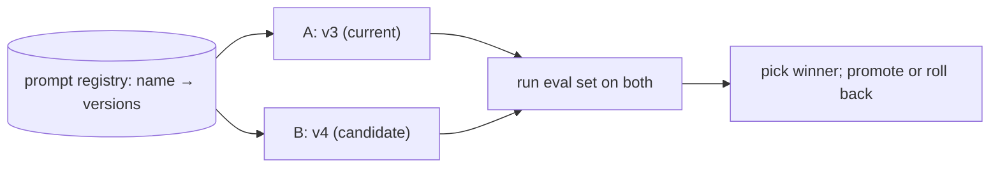

# Prompt versioning & A/B in the harness

> **Motto** — Prompts are code: version them, and prove a change is better before you ship it.

*Part of Phase 05 — Prompt & Instruction Architecture. Completes the phase.*

## The Problem

You tweak the system prompt and "it feels better." Then next week a different tweak quietly
regresses 5% of cases. Prompts deserve the same discipline as code: named versions, the
ability to roll back, and an A/B comparison scored by an eval (Phase 15) rather than vibes.
Without versioning you can't even tell which prompt produced a given result.

## The Concept



A registry stores versioned prompts; an A/B run scores both on a fixed eval set; you
promote the winner (and can revert instantly).

## Build It

`code/prompt_registry.py` — versioned prompts with selection and a tiny A/B harness:

```python
from dataclasses import dataclass, field

@dataclass
class PromptRegistry:
    versions: dict = field(default_factory=dict)     # name -> {version: text}
    active: dict = field(default_factory=dict)       # name -> version

    def register(self, name, version, text, activate=False):
        self.versions.setdefault(name, {})[version] = text
        if activate or name not in self.active:
            self.active[name] = version

    def get(self, name, version=None):
        return self.versions[name][version or self.active[name]]

    def rollback(self, name, version):
        self.active[name] = version

def ab_test(registry, name, va, vb, eval_set, run, score):
    """run(prompt, case)->output; score(output, case)->0..1. Returns mean scores."""
    def mean(v):
        outs = [score(run(registry.get(name, v), c), c) for c in eval_set]
        return sum(outs) / len(outs)
    return {va: mean(va), vb: mean(vb)}
```

```python
r = PromptRegistry()
r.register("sys", "v1", "Be terse.", activate=True)
r.register("sys", "v2", "Be terse. Always cite files.")
res = ab_test(r, "sys", "v1", "v2",
              eval_set=[{"want": "cite"}],
              run=lambda p, c: p, score=lambda o, c: 1.0 if c["want"] in o.lower() else 0.0)
print(res)     # {'v1': 0.0, 'v2': 1.0} → promote v2
```

Now "is the new prompt better?" has a number, and rollback is one call.

## Use It

For **Claude Code / Codex** users, the practical form is: keep your `CLAUDE.md`/`AGENTS.md`
and any custom skill prompts in git (they're versioned automatically), and when you change
one, run your eval set (Phase 15) on a few representative tasks before and after. The
registry here is what you'd build inside a larger harness or skill that ships multiple
prompt variants.

## Ship It

[`code/prompt_registry.py`](../../06-prompt-versioning/code/prompt_registry.py) — a versioned
prompt registry with rollback and an A/B harness.

## Check Yourself

**Q1.** Why version prompts?

- A) neatness
- B) to roll back regressions and know which prompt produced a result
- C) the API requires it
- D) no reason

<details><summary>Answer</summary>B — prompts are code; version and revert them.</details>

**Q2.** How do you decide a new prompt is better?

- A) it feels better
- B) A/B it on a fixed eval set and compare scores
- C) it's longer
- D) ask the model

<details><summary>Answer</summary>B — measure on an eval set (Phase 15).</details>

**Challenge.** Add a `canary` mode that routes 10% of calls to the candidate version and
logs scores, so you A/B in production gradually (ties to Phase 18 rollout).

## Related

- Builds on: the whole phase
- Deepens in: Phase 15 — Evals, Phase 18 — Rollout
- Phase complete → next: Phase 6 — [File & Code Operations](../../../../ROADMAP.md)
- [Roadmap](../../../../ROADMAP.md)
