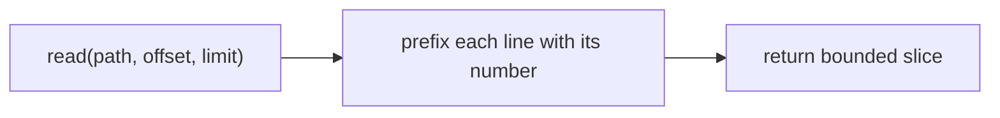

# A Read Tool with Line Numbers & Ranges

> **Motto** — The agent edits what it can cite — so reads return numbered lines and bounded ranges.

*Part of Phase 06 — File & Code Operations.*

## The Problem

An agent that edits code first has to *read* it — but reading a 5,000-line file whole blows
the context budget (Phase 4) and gives the model no way to refer to a location. The read
tool must return **line numbers** (so the model can cite `path:line` and target edits) and
support **ranges** (so it loads only what it needs).

## The Concept



Line numbers turn the file into an addressable surface; offset/limit keeps reads within
budget.

## Build It

`code/read_tool.py` — numbered, range-bounded reads:

```python
def read(path, offset=1, limit=2000):
    """Return lines [offset, offset+limit) prefixed with 1-based line numbers."""
    with open(path) as f:
        lines = f.readlines()
    start = max(0, offset - 1)
    chunk = lines[start:start + limit]
    width = len(str(start + len(chunk)))
    return "".join(f"{start+i+1:>{width}}  {ln}" for i, ln in enumerate(chunk))
```

```python
import tempfile, os
p = tempfile.mktemp()
open(p, "w").write("\n".join(f"content {i}" for i in range(1, 21)) + "\n")
print(read(p, offset=5, limit=3))     # lines 5–7, numbered
os.remove(p)
```

The numbering is exactly what lets the model say "change line 6" and what the edit tool
(next lesson) and `path:line` citations rely on.

## Use It

This is the **Read** tool in Claude Code / Codex: it returns `cat -n`-style numbered lines
and accepts offset/limit so the agent pages through large files instead of swallowing them.
Because reads are numbered and bounded, the agent's context stays lean (Phase 4) and its
edits stay precise.

## Ship It

[`code/read_tool.py`](../../01-read-tool/code/read_tool.py) — a numbered, range-bounded read
tool.

## Check Yourself

**Q1.** Why return line numbers from a read tool?

- A) decoration
- B) so the model can cite `path:line` and target precise edits
- C) speed
- D) no reason

<details><summary>Answer</summary>B — numbering makes the file addressable.</details>

**Q2.** Why support offset/limit?

- A) to load only what's needed and respect the context budget
- B) the OS requires it
- C) to sort lines
- D) no reason

<details><summary>Answer</summary>A — bounded reads keep context lean.</details>

**Challenge.** Add a `max_line_chars` that truncates very long lines (e.g. minified JS)
with a marker, so one giant line can't blow the budget.

## Related

- Builds on: Phase 4 — [Injecting context](../../../04-context-engineering/05-injecting-context/docs/en.md)
- Next: [Exact-string edit](../../02-edit-tool/docs/en.md)
- [Roadmap](../../../../ROADMAP.md)
