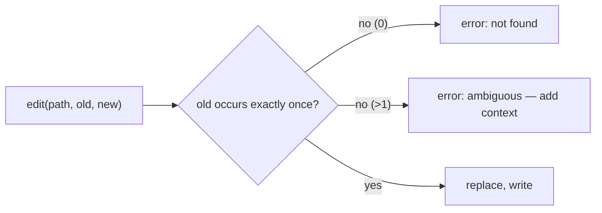

# Exact-String Edit & Why Diffs Beat Rewrites

> **Motto** — Edit by replacing a unique exact string, not by regenerating the whole file.

*Part of Phase 06 — File & Code Operations.*

## The Problem

The tempting way to "edit" with an LLM is to have it output the entire new file. That's
slow, token-hungry, and dangerous: the model silently drops a function or reformats code it
shouldn't touch. The robust primitive is an **exact-string replacement** — find one unique
occurrence of `old`, replace with `new` — so the change is surgical and verifiable, and
everything else is untouched by construction.

## The Concept



Uniqueness is the safety property: if `old` matches twice, refuse and ask for more
surrounding context, so you never edit the wrong spot.

## Build It

`code/edit_tool.py` — exact replace with a uniqueness guard:

```python
def edit(path, old, new):
    with open(path) as f:
        text = f.read()
    count = text.count(old)
    if count == 0:
        return "error: old_string not found"
    if count > 1:
        return f"error: old_string is ambiguous ({count} matches) — add surrounding context"
    with open(path, "w") as f:
        f.write(text.replace(old, new))
    return "ok: 1 replacement"
```

```python
import tempfile, os
p = tempfile.mktemp(); open(p, "w").write("def add(a, b):\n    return a + b\n")
print(edit(p, "return a + b", "return a + b  # sum"))   # ok
print(edit(p, "nope", "x"))                              # not found
os.remove(p)
```

A single, unambiguous replacement is auditable (it's a diff) and can't clobber unrelated
code.

## Use It

This is the **Edit** tool in Claude Code / Codex: it requires the `old_string` to match
exactly and uniquely, and errors if it's ambiguous — which is why the agent reads first
(lesson 01) to grab enough surrounding context for a unique match. `replace_all` is the
opt-in for intentional multi-site edits.

## Ship It

[`code/edit_tool.py`](../../02-edit-tool/code/edit_tool.py) — an exact-string edit tool with
a uniqueness guard.

## Check Yourself

**Q1.** Why replace an exact string instead of rewriting the whole file?

- A) it's prettier
- B) surgical edits can't silently drop or reformat unrelated code, and they're auditable
- C) the API requires it
- D) no reason

<details><summary>Answer</summary>B — precise, verifiable, safe.</details>

**Q2.** `old_string` matches twice. The tool should…

- A) edit both silently
- B) refuse and ask for more surrounding context (unless replace_all is set)
- C) edit the first
- D) crash

<details><summary>Answer</summary>B — ambiguity → refuse, to avoid wrong-spot edits.</details>

**Challenge.** Add `replace_all=True` support and return the replacement count, mirroring
the real Edit tool.

## Related

- Builds on: [Read tool](../../01-read-tool/docs/en.md)
- Next: [Write & overwrite safety](../../03-write-safety/docs/en.md)
- [Roadmap](../../../../ROADMAP.md)
