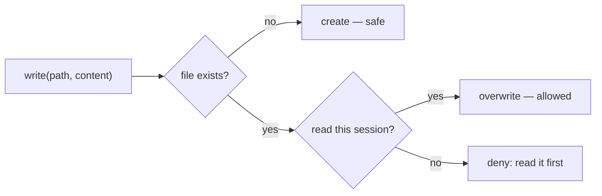

# Write & Overwrite Safety

> **Motto** — Writing a file is destructive — gate it so the agent never clobbers what it hasn't seen.

*Part of Phase 06 — File & Code Operations.*

## The Problem

`write(path, content)` replaces a file wholesale. If the agent writes a file it never read,
it may destroy content it didn't know was there. The safety rule coding agents use: you may
only overwrite a file you've **read this session** (so the model saw what it's replacing),
and new files are fine. This prevents the "agent nuked my config" class of incident.

## The Concept



## Build It

`code/write_tool.py` — a write tool that tracks reads and gates overwrites:

```python
import os

class FileWriter:
    def __init__(self):
        self.read_files = set()

    def read(self, path):
        self.read_files.add(os.path.abspath(path))
        with open(path) as f:
            return f.read()

    def write(self, path, content):
        ap = os.path.abspath(path)
        if os.path.exists(ap) and ap not in self.read_files:
            return "error: refusing to overwrite a file you haven't read this session"
        with open(ap, "w") as f:
            f.write(content)
        self.read_files.add(ap)
        return "ok: wrote " + path
```

```python
import tempfile, os
fw = FileWriter(); p = tempfile.mktemp()
print(fw.write(p, "v1"))            # new file: ok
open(p, "w").write("changed out-of-band")
print(fw.write(p, "v2"))            # exists but not read this session → denied
fw.read(p); print(fw.write(p, "v2"))  # now allowed
os.remove(p)
```

The gate is structural: the agent must demonstrate it has seen the file before it can
replace it.

## Use It

This is the **Write** tool rule in Claude Code / Codex: overwriting an existing file you
haven't read in the session is blocked; creating a new file is fine. It's why the agent
Reads before it Writes. For partial changes it prefers Edit (lesson 02) over Write
entirely.

## Ship It

[`code/write_tool.py`](../../03-write-safety/code/write_tool.py) — a read-gated write tool.

## Check Yourself

**Q1.** When may the agent overwrite an existing file?

- A) anytime
- B) only after reading it this session (so it saw what it's replacing)
- C) never
- D) only new files

<details><summary>Answer</summary>B — read-before-overwrite is the safety gate.</details>

**Q2.** For a small change to a large file, prefer…

- A) Write (rewrite the whole file)
- B) Edit (exact-string replacement)
- C) delete and recreate
- D) append

<details><summary>Answer</summary>B — Edit is surgical; Write risks clobbering.</details>

**Challenge.** Add a `.bak` backup written before each overwrite, and a `restore()` that
reverts the last write.

## Related

- Builds on: [Edit tool](../../02-edit-tool/docs/en.md)
- Next: [Glob & file discovery](../../04-glob/docs/en.md)
- [Roadmap](../../../../ROADMAP.md)
