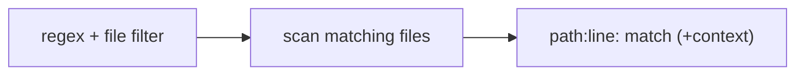

# Grep / Ripgrep-Style Content Search

> **Motto** — Find the right 20 lines in a million by searching content, not by reading everything.

*Part of Phase 06 — File & Code Operations.*

## The Problem

"Where is `parse_config` defined and used?" The agent can't read the whole repo to find
out — that's slow and blows the budget. It needs content search: a regex over files
returning `path:line: matched text`, optionally with surrounding context. This is how an
agent locates code before reading and editing it.

## The Concept



Grep returns *locations*; the agent then Reads the promising ones (lesson 01) and Edits
(lesson 02). Search → read → edit is the core file-ops loop.

## Build It

`code/grep_tool.py` — regex search with line numbers and optional context, stdlib:

```python
import re
from pathlib import Path

def grep(pattern, root=".", glob="**/*", context=0):
    rx = re.compile(pattern)
    hits = []
    for p in Path(root).glob(glob):
        if not p.is_file():
            continue
        try:
            lines = p.read_text().splitlines()
        except (UnicodeDecodeError, PermissionError):
            continue
        for i, line in enumerate(lines):
            if rx.search(line):
                lo, hi = max(0, i - context), min(len(lines), i + context + 1)
                for j in range(lo, hi):
                    mark = ":" if j == i else "-"
                    hits.append(f"{p}{mark}{j+1}: {lines[j]}")
    return hits
```

```python
import tempfile, os
d = tempfile.mkdtemp()
open(os.path.join(d, "x.py"), "w").write("def parse_config():\n    return {}\n")
print(grep(r"parse_config", root=d))   # ['.../x.py:1: def parse_config():']
```

The `path:line` format is what the agent cites and feeds straight into the read tool.

## Use It

This is the **Grep** tool in Claude Code / Codex (built on ripgrep): regex content search
with file-type/glob filters and context flags, returning matches the agent uses to navigate.
Glob (lesson 04) finds files by name; Grep finds them by content; Read loads the hit; Edit
changes it.

## Ship It

[`code/grep_tool.py`](../../05-grep/code/grep_tool.py) — a regex content-search tool with
line numbers and context.

## Check Yourself

**Q1.** What does grep return that the agent acts on next?

- A) the whole file
- B) `path:line` locations to Read and Edit
- C) a summary
- D) nothing

<details><summary>Answer</summary>B — locations drive the read→edit step.</details>

**Q2.** Search → ___ → edit is the core file-ops loop.

- A) compile
- B) read
- C) delete
- D) commit

<details><summary>Answer</summary>B — grep to locate, read to load, edit to change.</details>

**Challenge.** Add an `output_mode="files_with_matches"` that returns just the unique file
paths, like ripgrep's `-l`.

## Related

- Builds on: [Glob](../../04-glob/docs/en.md), [Read tool](../../01-read-tool/docs/en.md)
- Next: [Applying & validating patches](../../06-patches/docs/en.md)
- Deepens in: Phase 13 — Retrieval
- [Roadmap](../../../../ROADMAP.md)
