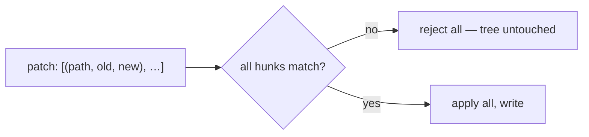

# Applying & validating patches

> **Motto** — A patch is a reviewable unit of change — apply it atomically or not at all.

*Part of Phase 06 — File & Code Operations.*

## The Problem

Single edits (lesson 02) are great for one spot, but a coherent change often spans several
hunks or files. Bundling them as a **patch** makes the change reviewable as a unit (the
review agent in Phase 10/15 sees a diff), and lets you apply it **atomically**: if any hunk
doesn't apply cleanly, reject the whole thing rather than leave the tree half-edited.

## The Concept



Validate every hunk first; only write if all pass. All-or-nothing avoids partial,
inconsistent edits.

## Build It

`code/patch.py` — an atomic multi-hunk patch applier:

```python
def apply_patch(hunks, read, write):
    """hunks: [(path, old, new)]. read(path)->str, write(path,str). Atomic."""
    staged = {}
    for path, old, new in hunks:
        text = staged.get(path, read(path))
        if text.count(old) != 1:
            return f"reject: hunk for {path} matches {text.count(old)}x (need exactly 1)"
        staged[path] = text.replace(old, new)
    for path, text in staged.items():        # only reached if every hunk validated
        write(path, text)
    return f"applied {len(hunks)} hunk(s) across {len(staged)} file(s)"
```

```python
files = {"a.py": "x = 1\n", "b.py": "y = 2\n"}
res = apply_patch(
    [("a.py", "x = 1", "x = 10"), ("b.py", "y = 2", "y = 20")],
    read=lambda p: files[p], write=lambda p, t: files.__setitem__(p, t))
print(res, files)         # applied 2 hunks; both files updated
```

If the second hunk had failed validation, the first would *not* have been written — the
tree stays consistent.

## Use It

When Claude Code / Codex make a multi-file change, each edit is an exact-string replacement
(lesson 02), and the *set* of edits is what you review as a diff before it lands (and what
the review gate scores, Phase 10/15). The atomic-validate-then-apply discipline here is what
keeps a multi-file change from landing half-done.

## Ship It

[`code/patch.py`](../../06-patches/code/patch.py) — an atomic multi-hunk patch applier.

## Check Yourself

**Q1.** Why apply a multi-hunk patch atomically?

- A) speed
- B) so a failing hunk can't leave the tree half-edited and inconsistent
- C) the OS requires it
- D) no reason

<details><summary>Answer</summary>B — all-or-nothing keeps the tree consistent.</details>

**Q2.** Why is a patch a good review unit?

- A) it's short
- B) it's a diff — the reviewer (Phase 10/15) judges the whole change at once
- C) it's binary
- D) no reason

<details><summary>Answer</summary>B — a diff is the reviewable artifact.</details>

**Challenge.** Make the applier produce a unified-diff string for the staged changes (so a
human/reviewer can see exactly what would change before you commit).

## Related

- Builds on: [Edit tool](../../02-edit-tool/docs/en.md)
- Next: [Use It: tree-sitter for structural edits](../../07-tree-sitter/docs/en.md)
- Reviewed by: Phase 10/15
- [Roadmap](../../../../ROADMAP.md)
