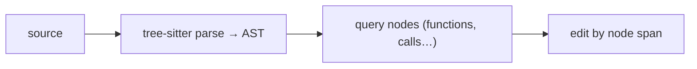

# Use It: Tree-sitter for Structural Edits

> **Motto** — Some edits are about *structure*, not strings — parse the code to target them.

*Part of Phase 06 — File & Code Operations. Completes the phase.*

## The Problem

Exact-string edits (lesson 02) cover most changes, but some are inherently structural:
"rename this function everywhere it's *called*", "add a parameter to every method in this
class", "find all functions missing a docstring". String matching can't reliably tell a
call from a definition from a comment. For these you parse the code into a syntax tree and
operate on nodes — that's what **tree-sitter** gives you.

## The Concept



A parser turns text into a typed tree; you query node types and edit by their byte/line
spans — precise where strings are ambiguous.

## Build It / Use It

Tree-sitter is a library, so this is **Use It**. `code/structural.py` shows the shape with
`tree_sitter` (install required); it also includes a stdlib `ast`-based fallback that runs
here, listing every function definition and its line — the kind of structural query strings
can't do reliably:

```python
import ast

def list_functions(source):
    tree = ast.parse(source)
    return [(n.name, n.lineno) for n in ast.walk(tree)
            if isinstance(n, ast.FunctionDef)]

def functions_missing_docstring(source):
    tree = ast.parse(source)
    return [n.name for n in ast.walk(tree)
            if isinstance(n, ast.FunctionDef) and ast.get_docstring(n) is None]
```

```python
src = "def a():\n    'doc'\n    pass\ndef b():\n    pass\n"
print(list_functions(src))                 # [('a', 1), ('b', 4)]
print(functions_missing_docstring(src))    # ['b']
```

`ast` is Python-only; **tree-sitter** generalizes this to dozens of languages with one API,
which is why coding agents use it for cross-language structural understanding.

## Use It

Claude Code / Codex lean on string Edit for most changes, but structural awareness (via
tree-sitter under the hood, or language servers) powers things like accurate symbol
navigation and large-scale refactors. When your task is "every call site" or "every method,"
reach for a parser instead of a regex.

## Ship It

[`code/structural.py`](../../07-tree-sitter/code/structural.py) — structural queries (ast
fallback now; tree-sitter for multi-language).

## Check Yourself

**Q1.** When is a parser better than exact-string editing?

- A) always
- B) for structural edits (call sites vs. definitions, every method) where strings are ambiguous
- C) never
- D) only for JSON

<details><summary>Answer</summary>B — structure-aware tasks need an AST.</details>

**Q2.** Why tree-sitter over Python's `ast` in a real agent?

- A) it's older
- B) it parses dozens of languages with one API
- C) it's pure Python
- D) no reason

<details><summary>Answer</summary>B — multi-language structural parsing.</details>

**Challenge.** Use the `ast` helper to find every function with more than N parameters — a
structural lint a string search couldn't do reliably.

## Related

- Builds on: [Edit tool](../../02-edit-tool/docs/en.md), [Patches](../../06-patches/docs/en.md)
- Phase complete → next: Phase 7 — [Shell & Sandbox Execution](../../../../ROADMAP.md)
- [Roadmap](../../../../ROADMAP.md)
