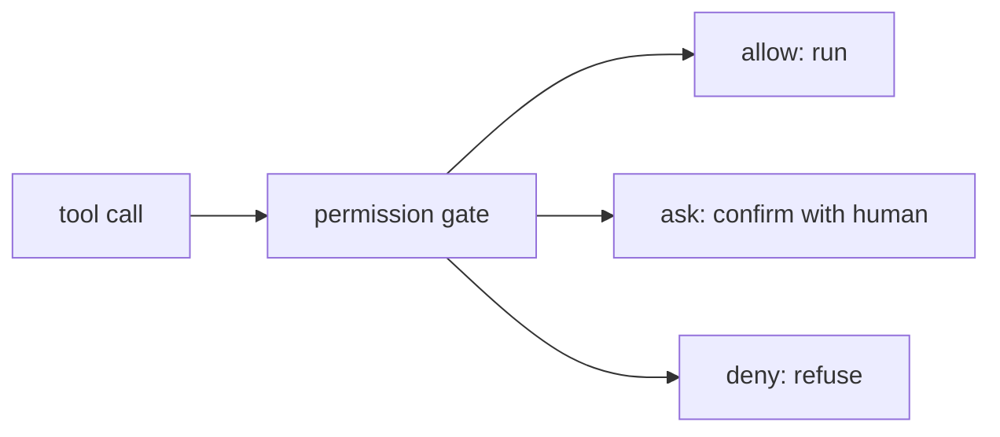

# Permission Gate: Allow, Ask, Deny

> **Motto** — Every tool call crosses one gate, and the gate answers allow, ask, or deny from rules the model cannot change.

*Part of Phase 06 — Permissions and Security.*

*Last reviewed: 2026-10 · Volatility: fast*

## The Problem

An agent that runs every call unchecked is a liability. An agent that asks before every call is unusable. Rules fix this. Routine reads run free, and risky actions stop for a human.

Two details cause most mistakes. Rules overlap, so you need a fixed order. And a shell command is often several commands joined with `&&` or `;`. A rule that checks only the first word is easy to slip past.

## The Concept



The gate reads three rule lists. It checks **deny** first, then **ask**, then **allow**. The first list with a match decides. A narrow allow can never carve an exception out of a broad deny. A call that no rule matches falls to the **mode**, which is `ask` by default.

For shell commands, split the text into subcommands. A deny or ask rule fires if any part matches. An allow rule must cover every part. One unknown part turns the whole call into an ask.

When the human picks "always", the gate saves a new allow rule. The human teaches the policy by using it.

## Build It

`code/permission_gate.py` models the rule syntax of Claude Code settings. Matching and splitting come first:

```python
def bash_match(pattern, command):
    if pattern.endswith(":*"):
        pattern = pattern[:-2] + " *"              # ":*" is a trailing " *"
    body = re.escape(pattern).replace(r"\*", ".*")
    if pattern.endswith(" *") and pattern.count("*") == 1:
        body = re.escape(pattern[:-2]) + "( .*)?"  # "ls *" also matches bare "ls"
    return re.fullmatch(body, command) is not None


def subcommands(command):
    """Split a compound command. Quotes are ignored here, a known simplification."""
    parts = re.split(r"&&|\|\||[;|&\n()`]", command)
    words = [re.sub(r"^(?:\$|time |nohup |nice |timeout \d+ )+", "", p.strip()) for p in parts]
    return [w for w in words if w]
```

Then the decision, in deny, ask, allow order, and the approval flow:

```python
    def decide(self, tool, arg=""):
        parts = subcommands(arg) if tool == "Bash" else [arg]
        if any(self._hit(self.rules[DENY], tool, p) for p in parts):
            return DENY                            # deny sees every subcommand
        if any(self._hit(self.rules[ASK], tool, p) for p in parts):
            return ASK
        if all(self._hit(self.rules[ALLOW], tool, p) for p in parts):
            return ALLOW                           # allow must cover every subcommand
        if self.mode == "plan" and tool in ("Edit", "Write"):
            return DENY
        if self.mode == "acceptEdits" and tool in ("Edit", "Write"):
            return ALLOW
        return DENY if self.mode == "dontAsk" else ASK

    def run(self, tool, arg, execute, confirm):
        """confirm(tool, arg) -> "once" | "always" | "deny"."""
        verdict = self.decide(tool, arg)
        if verdict == DENY:
            return "denied by rule"
        if verdict == ASK:
            choice = confirm(tool, arg)
            if choice == "deny":
                return "denied by user"
            if choice == "always":
                self.remember(tool, arg)
        return execute(tool, arg)

    def remember(self, tool, arg):
        """'Yes, and do not ask again' saves an allow rule for the command prefix."""
        for sub in (subcommands(arg) if tool == "Bash" else [arg]):
            rule = f"{tool}({' '.join(sub.split()[:2])} *)" if tool == "Bash" else tool
            self.rules[ALLOW].append(rule)
```

The asserts check the order and the edges. Deny beats a wide allow. A deny inside `git status && git push` still fires. `echo $(rm -rf build)` is caught. One unknown part makes the call ask. A saved "always" rule does not override an ask rule or a deny rule.

The file also asserts a gap on purpose: `/bin/rm -rf build` and `bash -c 'rm -rf build'` are not caught by `rm *`. A rule matches text, and text has many spellings. The next two lessons add layers for this.

## Use It

Claude Code uses the same shape. Rules are `Tool` or `Tool(specifier)`, for example `Bash(npm run test *)` or `Read(./.env)`. Verified details:

- Order is deny, ask, allow. Specificity does not change the order. A broad `Bash(aws *)` deny beats a narrow `Bash(aws s3 ls)` allow.
- `Bash(ls *)` matches `ls` and `ls -la`, but not `lsof`. `:*` at the end is an equivalent trailing wildcard.
- Deny and ask rules apply when any subcommand matches, including inside subshells. Claude Code strips wrappers such as `timeout`, `time`, `nice` and `nohup` before it matches.
- A rule does not match `/bin/rm` or `bash -c '...'`. The docs say not to treat Bash rules as a security boundary.
- Modes are `default`, `acceptEdits`, `plan`, `auto`, `dontAsk` and `bypassPermissions`. `dontAsk` turns every would-be prompt into a denial. Use `bypassPermissions` only in an isolated container or VM.
- "Yes, and don't ask again" saves a Bash rule to `.claude/settings.local.json`. A saved file-edit approval lasts until the session ends.
- Rules are enforced by Claude Code, not by the model. A line in `CLAUDE.md` does not change what is allowed.

The [Settings.json](../../03-settings-json/docs/en.md) lesson shows these rules in a real file.

## Challenge

Make `remember` write the new allow rule to a JSON file shaped like `{"permissions": {"allow": [...]}}`. Load that file when a new `PermissionGate` starts. Add `revoke(rule)`. Assert that a rule saved in one gate is allowed in a second gate, and that it is gone after a revoke.

## Sources

Claude Code docs, "Configure permissions" (code.claude.com/docs/en/permissions).

Next: [Hooks](../../02-hooks/docs/en.md)
