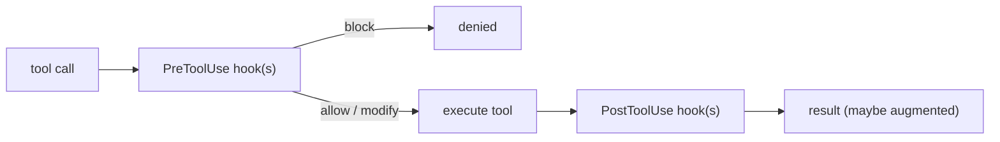

# Hooks: Rules That Run as Code

> **Motto** — A hook is a script the harness runs around a tool call, so a rule holds even when the model ignores a prompt.

*Part of Phase 06 — Permissions and Security.*

*Last reviewed: 2026-10 · Volatility: fast*

## The Problem

Some rules must be guaranteed, not requested. "Never touch `.env`." "Check the lint result after every write." A line in the prompt only asks the model. A **hook** is code the harness runs before and after each tool call. It does not depend on what the model decides.

Secrets are the first case. A key hard-coded in source is already leaked once it reaches git history. An agent that edits `.env` can print the key into a transcript. Hygiene must be structural: keep secrets in the environment, git-ignore `.env`, and block the agent from the file with a hook.

## The Concept



A hook is a command. The harness sends it one JSON object on stdin. A PreToolUse event carries `tool_name`, `tool_input`, `cwd` and `permission_mode`, among other fields. The hook answers in one of two ways:

- **Exit code 2.** The call is blocked. The text on stderr becomes the reason.
- **Exit 0 with JSON.** A `hookSpecificOutput` object with `permissionDecision` set to `deny` blocks the call.

Exit 0 with no output means "no opinion". The call goes on through the normal permission flow. Any other exit code, such as 1, is a non-blocking error, so the call still runs. A hook that fails by crashing therefore fails open. Make your own hooks exit 2 when they cannot parse their input.

A PostToolUse hook runs after the tool. It cannot undo the call. It can send feedback to the model.

## Build It

`code/hooks.py` is a model of this contract. It runs real hook commands, feeds them JSON, and reads the exit code. It is a model of the idea, not Claude Code.

```python
class HookRunner:
    def __init__(self):
        self.hooks = {"PreToolUse": [], "PostToolUse": []}     # (matcher, argv)

    def add(self, event, matcher, argv):
        self.hooks[event].append((matcher, argv))

    def _run(self, argv, payload):
        p = subprocess.run(argv, input=json.dumps(payload), capture_output=True,
                           text=True, timeout=30)
        return p.returncode, p.stdout, p.stderr

    def pre(self, tool, tool_input):
        """Return ("deny", reason) or ("none", ""). A hook never needs to say allow."""
        event = {"hook_event_name": "PreToolUse", "tool_name": tool, "tool_input": tool_input}
        for matcher, argv in self.hooks["PreToolUse"]:
            if not matches(matcher, tool):
                continue
            code, out, err = self._run(argv, event)
            if code == 2:                                       # blocking error
                return "deny", err.strip()
            if code == 0 and out.strip().startswith("{"):
                decision = json.loads(out).get("hookSpecificOutput", {})
                if decision.get("permissionDecision") == "deny":
                    return "deny", decision.get("permissionDecisionReason", "")
            # any other exit code is a non-blocking error: the call goes on
        return "none", ""

    def post(self, tool, tool_input, result):
        """The tool already ran. Exit 2 cannot undo it, but stderr goes back to the model."""
        event = {"hook_event_name": "PostToolUse", "tool_name": tool,
                 "tool_input": tool_input, "tool_response": result}
        for matcher, argv in self.hooks["PostToolUse"]:
            if matches(matcher, tool):
                code, _, err = self._run(argv, event)
                if code == 2:
                    result += f"\n[hook feedback] {err.strip()}"
        return result

    def call(self, tool, tool_input, execute, rules=None):
        verdict, reason = self.pre(tool, tool_input)
        if verdict == "deny":
            return f"blocked by hook: {reason}"
        if rules and rules(tool, tool_input) == "deny":         # a hook cannot override deny rules
            return "blocked by rule"
        return self.post(tool, tool_input, execute(tool, tool_input))
```

`outputs/block_env_hook.py` is a working PreToolUse hook. It denies Read, Edit, Write and Bash calls that name a `.env` file. It lets `.env.example` through. This is its core:

```python
def main():
    try:
        event = json.load(sys.stdin)
        if not isinstance(event, dict):
            raise ValueError("event is not an object")
        bad = [p for p in paths_in(event) if is_secret_env(p)]
    except Exception as exc:                           # any failure blocks the call
        print(f"env hook: cannot read the event ({exc})", file=sys.stderr)
        return 2                                       # fail closed
    if not bad:
        return 0                                       # no opinion
    print(json.dumps({"hookSpecificOutput": {
        "hookEventName": "PreToolUse",
        "permissionDecision": "deny",
        "permissionDecisionReason": f"{bad[0]} holds secrets; the agent may not touch it",
    }}))
    return 0
```

The asserts in `hooks.py` run that hook. They show that a blocked call never executes, that a PostToolUse hook adds feedback, that exit 1 does not block, and that exit 2 does. They also show that a deny rule still wins when no hook objects. You can test the hook by hand: `echo '{"tool_name":"Edit","tool_input":{"file_path":".env"}}' | python3 outputs/block_env_hook.py`.

## Use It

Claude Code hooks live in `settings.json` in three levels: an event, a matcher group, and a list of handlers. A handler has `"type": "command"` and a `command`. The matcher filters on the tool name. `Edit|Write` is an exact list. Anything with other characters is a regex. `*` or an empty matcher matches all.

Facts to rely on:

- PreToolUse hooks run before the permission prompt, for every tool except `EndConversation`.
- Exit 2 blocks the call before permission rules are checked. A blocking hook beats an allow rule.
- A hook that returns `allow` does not bypass a deny rule or an ask rule.
- `permissionDecision` can be `allow`, `deny`, `ask` or `defer`. `updatedInput` can rewrite the arguments.
- Hooks run outside the sandbox with your full access. Review them like code.

The [Settings.json](../../03-settings-json/docs/en.md) lesson wires `block_env_hook.py` and the egress hook into one file.

## Challenge

Write a PostToolUse hook that reads `tool_response`, finds a string shaped like `AKIA` plus 16 capital letters or digits, and exits 2 with a warning. Add it to `hooks.py` with an assert. Then say why this hook can warn but cannot block.

## Sources

Claude Code docs, "Hooks reference" and "Configure permissions", section "Extend permissions with hooks" (code.claude.com/docs/en).

Next: [Settings.json](../../03-settings-json/docs/en.md)
