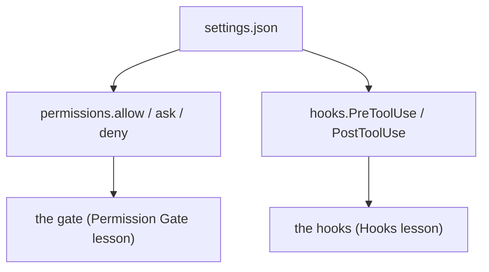

# Settings.json: Declare the Safety Layer

> **Motto** — The gate and the hooks you built are configuration in Claude Code, so put them in a file the team can review.

*Part of Phase 06 — Permissions and Security.*

*Last reviewed: 2026-10 · Volatility: fast*

## The Problem

You built a permission gate and hooks by hand. In Claude Code you do not rewrite them. You declare them. The risk moves from code to a config file, and config files fail quietly. A rule with the wrong syntax is not an error. It is a rule that never fires.

Three mistakes are common. A rule is written for a tool that is never consulted. A `Bash` rule is written in a form that does not match. A hook points at a script that does not exist.

## The Concept



Settings come from several files. `~/.claude/settings.json` is yours. `.claude/settings.json` is the shared project file. `.claude/settings.local.json` is yours alone. Managed settings rank highest, then the command line, local, project and user.

Rules run in one order: deny, ask, allow. First match wins. A hook that says allow does not override a deny or ask rule. A hook that exits 2 blocks the call before the rules run.

Three syntax facts decide if a rule works:

- Only `Read(path)` and `Edit(path)` rules are consulted for file paths. `Write(src/**)` and `Glob(*)` are accepted but never used.
- `Bash(npm run test *)` is the usual form. `:*` at the end is an equivalent wildcard. It is not valid in the middle of a pattern.
- A `Read` deny rule also blocks Edit and Write on that path (Claude Code 2.1.228 or later; `NotebookEdit` needs its own `Edit` deny rule). `//path` is absolute. A single `/path` is relative to the settings source.

## Build It

`outputs/settings.json` is a working project file:

```json
{
  "permissions": {
    "defaultMode": "default",
    "allow": [
      "Bash(git diff *)",
      "Bash(npm run test *)",
      "Bash(npm run lint *)"
    ],
    "ask": [
      "Bash(git commit *)"
    ],
    "deny": [
      "Bash(git push *)",
      "Bash(rm *)",
      "Read(./.env)",
      "Edit(./.env)",
      "Read(./secrets/**)"
    ]
  },
  "hooks": {
    "PreToolUse": [
      {
        "matcher": "Read|Edit|Write|Bash",
        "hooks": [
          { "type": "command", "command": "${CLAUDE_PROJECT_DIR}/.claude/hooks/block_env_hook.py" }
        ]
      },
      {
        "matcher": "Bash",
        "hooks": [
          { "type": "command", "command": "${CLAUDE_PROJECT_DIR}/.claude/hooks/egress_guard_hook.py" }
        ]
      }
    ]
  },
  "sandbox": {
    "enabled": true,
    "network": {
      "allowedDomains": ["github.com", "*.npmjs.org", "pypi.org"]
    }
  }
}
```

`code/check_settings.py` lints it. It checks the rule syntax, finds inert rules, and confirms that each hook script exists. It then runs every hook once with a harmless event. Last, it feeds the file's rules through the gate from the [Permission Gate](../../01-permission-gate/docs/en.md) lesson.

```python
def lint(settings):
    """Return a list of problems. An empty list means the file looks right."""
    problems = []
    perms = settings.get("permissions", {})
    for kind in ("allow", "ask", "deny"):
        for rule in perms.get(kind, []):
            m = re.fullmatch(r"(\w+)(?:\((.*)\))?", rule)
            if not m:
                problems.append(f"{kind}: {rule!r} is not Tool or Tool(specifier)")
                continue
            tool, spec = m.groups()
            if tool in INERT and spec:
                problems.append(f"{rule}: path rules for {tool} are never consulted; use Edit(...) or Read(...)")
            if tool == "Bash" and spec:
                if re.match(r"command:", spec):
                    problems.append(f"{rule}: matching on the command field is ignored")
                if ":*" in spec[:-2]:
                    problems.append(f"{rule}: ':*' only works at the end of a pattern")
                if kind == "allow" and re.match(r"\w+ \* ", spec):
                    problems.append(f"{rule}: put the * after the subcommand")
    for event, groups in settings.get("hooks", {}).items():
        for group in groups:
            for hook in group.get("hooks", []):
                if hook.get("type") != "command" or "command" not in hook:
                    problems.append(f"{event}: hook needs type 'command' and a command")
                    continue
                script = hook["command"].split("/")[-1]
                if not any(os.path.isfile(os.path.join(d, script)) for d in HOOK_DIRS):
                    problems.append(f"{event}: hook script {script} does not exist")
    return problems
```

The asserts make the lint able to fail. A broken copy adds six bad rules and a missing hook script. The lint must name each one. The real file must come back clean, and `git push` must be denied even when it follows `git diff &&`.

## Use It

Install the file in four steps.

1. Copy `outputs/settings.json` to `.claude/settings.json`.
2. Copy `block_env_hook.py` from [Hooks](../../02-hooks/docs/en.md) and `egress_guard_hook.py` from [Sandbox and Egress](../../../05-files-and-shell/06-sandbox-and-egress/docs/en.md) into `.claude/hooks/`.
3. Copy `egress_guard.py` from that lesson's `code/` folder next to the egress hook. Run `chmod +x` on both hooks.
4. Run `/permissions` in a session to see each rule and the file it came from.

The hook paths use `${CLAUDE_PROJECT_DIR}`, the project root where the session started. The `sandbox` block turns on the OS sandbox and allows three domains. Permissions and the sandbox are separate layers. Use both. Sandbox limits still hold if a prompt injection fools the model.

Remember what the file cannot do. A deny rule matches command text, so `/bin/rm` and `bash -c` slip past `Bash(rm *)`. A hook cannot see inside a script. Only the sandbox enforces at the operating-system level.

## Challenge

Extend `lint` to flag `Read` and `Edit` rules that start with a single `/` and look like a filesystem path, such as `Read(/Users/me/.ssh/**)`. That form anchors at the settings source, so the rule does not protect `~/.ssh`. The fix is `Read(//Users/me/.ssh/**)` or `Read(~/.ssh/**)`. Add a broken case to the asserts.

## Sources

Claude Code docs: "Configure permissions", "Hooks reference" and "Configure the sandboxed Bash tool" (code.claude.com/docs/en).

Next: [Untrusted Content](../../04-untrusted-content/docs/en.md)
