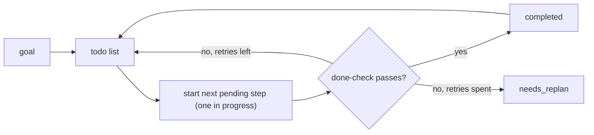

# The Todo List

> **Motto** — A long task is a list of small ones with status, and a step is done only when its check passes.

*Part of Phase 07 — Planning and Subagents.*

*Last reviewed: 2026-10 · Volatility: fast*

## The Problem

On a task with many steps, an agent drifts. It forgets a step. It repeats one. It declares victory early. Two failures are common.

First, the agent marks a step done when it never passed its check. That is false progress. Second, a step fails and the agent retries it forever. That is grinding.

A **todo list** fixes both. It is a list of steps with a status. The harness owns the list, so you and the agent see the same plan. The harness also decides when a step counts as done.

## The Concept



Four statuses cover everything: `pending`, `in_progress`, `completed`, `needs_replan`.

Two rules keep the list honest. Only one step is `in_progress` at a time, so work does not split into half-done threads. And the agent cannot mark a step `completed` by saying so. A check must pass. After a set number of failures, the step goes to `needs_replan` and the agent or the human changes the approach.

## Build It

`code/todo.py` holds the whole model. The `start` method enforces the single in-progress rule:

```python
    def start(self, tid):
        if any(t.status == "in_progress" for t in self.tasks):
            raise ValueError("finish the in-progress task first")
        self._get(tid).status = "in_progress"
```

The `finish` method takes a `verify` function. The harness calls it, not the model:

```python
    def finish(self, tid, verify):
        """Mark done only if the done-check passes. Else count a failure."""
        task = self._get(tid)
        if verify():
            task.status = "completed"
        else:
            task.failures += 1
            # Out of retries: stop grinding and hand the step back for re-planning.
            task.status = "needs_replan" if task.failures >= self.max_failures else "pending"
        return task.status
```

A passing check completes the step. A failing check sends it back to `pending` for one more try. A second failure (the default `max_failures=2`) sets `needs_replan`, and `next_pending` skips it. The file ends with asserts that prove each rule: a second `start` raises, a failed check never completes a step, and the list moves past a stuck step.

In a real harness, `verify` runs a test command or a file check. Do not let `verify` be a model opinion. A model that grades its own work passes it too often.

## Use It

Claude Code ships task tools for this: `TaskCreate`, `TaskGet`, `TaskList` and `TaskUpdate`. The model creates tasks, updates their status as it works, and lists them again to see what is left. The older `TodoWrite` tool is off by default in favour of these.

The tools store the list. They do not run your done-checks. You add that part yourself. Put it in your instructions ("run the tests before you mark a step complete"), or enforce it with a hook (see [Hooks](../../../06-permissions-and-security/02-hooks/docs/en.md)).

When you start a big task, ask for a plan first. The list gives you a checkpoint. You can correct the course before the agent builds the wrong thing.

## Challenge

Add dependencies to `Task` (a list of task ids). Write `next_actionable()` so a step cannot start until all its dependencies are `completed`. Assert that a step blocked by a `needs_replan` dependency is never returned. [Lesson 03](../../03-contract-waves-and-isolation/docs/en.md) uses the same idea to order work.

## Sources

Claude Code docs, "Tools reference" (code.claude.com/docs).

Next: [Plan mode](../../02-plan-mode/docs/en.md)
