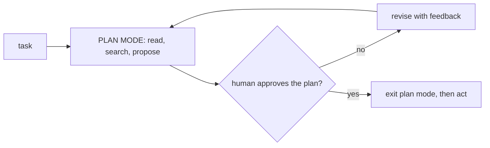

# Plan Mode

> **Motto** — For risky or unclear work, the agent proposes a plan and waits, and it stays read-only until you say go.

*Part of Phase 07 — Planning and Subagents.*

*Last reviewed: 2026-10 · Volatility: fast*

## The Problem

An agent that starts editing at once on a big or vague task builds the wrong thing fast. You find out after the diff is large. Then you pay twice: once to build it and once to undo it.

Asking nicely ("plan first, do not edit yet") is weak. The model can forget or decide the plan is obvious. You want the harness to enforce the pause.

## The Concept



**Plan mode** is a permission state. Reads are allowed. In this model, edits and risky commands are denied. In Claude Code, edits are blocked, and commands outside the read-only set prompt you or go to the auto-mode classifier. The agent can explore the codebase and write a plan. It cannot change anything.

A human then makes a decision. Reject, and the agent stays read-only and revises. Approve, and the state changes to acting. The permission gate from [Phase 06](../../../06-permissions-and-security/01-permission-gate/docs/en.md) does the enforcing, so plan mode is a setting and not a promise.

## Build It

`code/plan_mode.py` is a small model of the idea. It is not Claude Code's code. It has three states: `planning`, `awaiting_approval` and `acting`. The gate decides one tool call:

```python
    def gate(self, tool, command=None):
        """Return 'allow' or 'deny: <reason>' for one tool call."""
        if self.state == "acting":
            return "allow"
        if tool in READ_ONLY_TOOLS:
            return "allow"
        if tool == "bash" and command in READ_ONLY_COMMANDS:
            return "allow"                # exploring with a read-only command is fine
        return f"deny: '{tool}' is blocked until a plan is approved"
```

Note the third rule. A plan needs exploration, and exploration needs `git status` or `ls`. So read-only shell commands pass and everything else is denied.

The `decide` method moves the state. Approval sets `acting`. Rejection returns to `planning` so the agent revises. The asserts check that proposing a plan does not unlock edits, that a rejected plan leaves the agent read-only, and that only approval allows an edit.

## Use It

Plan mode is one of the Claude Code permission modes (`default`, `acceptEdits`, `plan`, `auto`, `dontAsk`, `bypassPermissions`). You can enter it three ways:

- Press `Shift+Tab` to cycle modes.
- Prefix one prompt with `/plan`.
- Start a session with `claude --permission-mode plan`.

In plan mode Claude reads files, runs shell commands to explore, and writes a plan. It does not edit your source. When the plan is ready, you pick one of the approve options or choose to keep planning with feedback. Approving exits plan mode and switches the session to the mode that option names, so editing starts.

Two details matter. Plan mode keeps its blocks in non-interactive runs (`-p`) and in Agent SDK sessions. But in an interactive terminal session where bypass permissions is available, Claude Code does not enforce those blocks. Claude is still told to plan without editing, but an edit it attempts runs anyway. Do not rely on plan mode as a guard in that setup.

To make plan mode the default for a project, set `defaultMode` to `plan` in `.claude/settings.json`. A subagent definition can also set `permissionMode: plan`.

## Challenge

Connect `PlanMode` to a permission gate. Write a gate with three decisions (allow, ask, deny) and a `plan` mode in which every mutating tool returns `deny`. Show with an assert that switching the mode to `acting` changes only the mutating decisions, and that a deny rule still wins in both modes.

## Sources

Claude Code docs, "Choose a permission mode" (code.claude.com/docs).

Next: [Contract, waves and isolation](../../03-contract-waves-and-isolation/docs/en.md)
