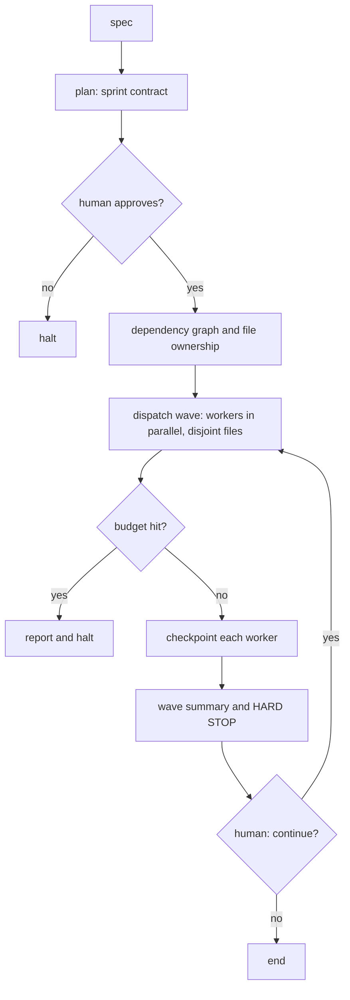

# Contract, Waves and Isolation

> **Motto** — Lock the contract, declare the budget, give each worker its own files, and stop between waves for a human.

*Part of Phase 07 — Planning and Subagents.*

*Last reviewed: 2026-10 · Volatility: fast*

## The Problem

One subagent is easy. Several agents on one repo is where harnesses fail.

Two workers edit `api/routes.py`. The later one overwrites the earlier one. No error appears. A run loops far past its purpose and spends real money. An interrupted run restarts from zero. Nobody approved what got built.

A smarter prompt does not fix this. Structure does. A **contract** fixes the target and the budget before any worker starts. **Waves** group the work so that no two workers share a file. A hard stop between waves lets a human decide.

## The Concept



Four rules hold the design together.

1. **No worker runs until a human approves the contract.**
2. **The budget is a hard ceiling.** Workers, calls per worker and waves are all capped. Hitting a cap stops the run. It never extends itself.
3. **No two workers in a wave share a file.** A task also waits for its dependencies.
4. **Each worker writes a checkpoint.** A rerun skips finished work.

## Build It

The contract is data. `outputs/sprint-contract.json` holds one. Its numbers (3 workers, 15 calls per worker, 2 waves) are example values. Set your own from your task size and cost limit.

`plan_waves` is the core. It builds each wave from tasks whose dependencies are done and whose files do not overlap with the wave so far. If it cannot place any task, it names the stuck tasks:

```python
def plan_waves(tasks):
    """Group tasks so no wave shares a file and every dependency lands first."""
    done, waves, remaining = set(), [], list(tasks)
    while remaining:
        wave, used = [], set()
        for t in remaining:
            if set(t.deps) <= done and not (set(t.files) & used):
                wave.append(t)
                used |= set(t.files)
        if not wave:
            raise ValueError("cycle in deps: " + ", ".join(t.name for t in remaining))
        for t in wave:
            remaining.remove(t)
            done.add(t.name)
        waves.append(wave)
    return waves
```

Two tasks that own the same file land in different waves, even with no declared dependency. That is the guard against silent overwrite.

`run_sprint` runs each wave in a `ThreadPoolExecutor`, so the workers in a wave run at the same time. The test proves it. Two workers wait on a `threading.Barrier`. If the wave ran them one after another, the barrier would time out and the test would fail.

The worker is a stub that returns a string. The coordination is real: approval, budget, parallel dispatch, checkpoint files, resume, and the hard stop. A `CallMeter` raises `BudgetExceeded` when a worker passes its call limit, and the sprint halts.

For file isolation on disk, each worker needs its own working tree. `worktree_cmds` prints the `git worktree add` command for each task. The demo does not run it.

## Use It

Claude Code subagents map to this design. A subagent is a Markdown file in `.claude/agents/` with YAML frontmatter. Each one runs in its own context window and returns only its final report to the parent.

Set `isolation: worktree` in the frontmatter and the subagent works in its own git worktree, so parallel edits cannot touch the same tree. The `maxTurns` field caps its turns, which plays the role of the call budget.

Claude Code has no built-in "wave" command. Treat the wave plan as your own process. Approve the contract, start one wave, read the summaries, then start the next. The hard stop is you.

## Challenge

Add a `dry_run=True` option to `run_sprint`. It should print each wave and its worker count and return without calling any worker. Assert that no checkpoint file exists afterward.

## Sources

Claude Code docs, "Subagents" (code.claude.com/docs).

Next: [Supervisor and workers](../../04-supervisor-and-workers/docs/en.md)
