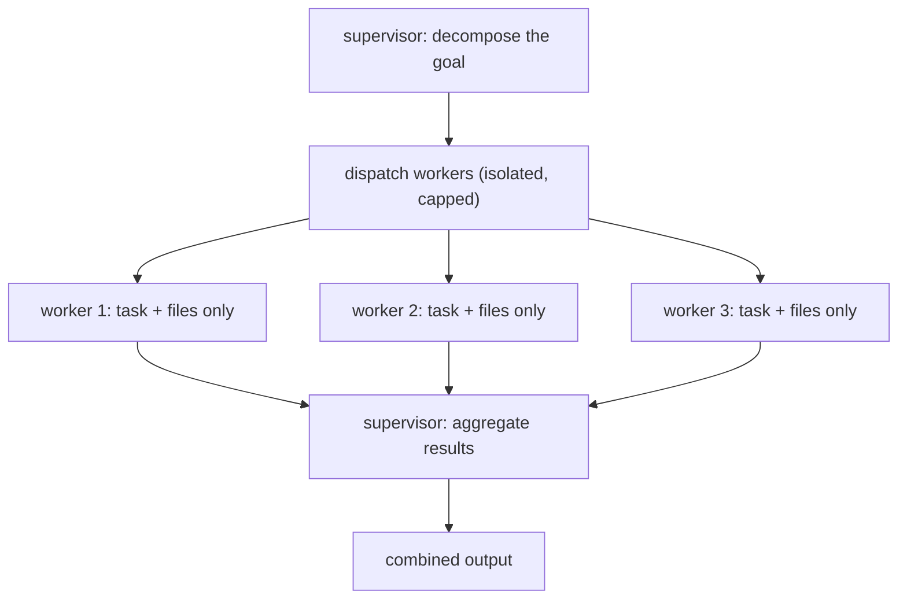

# Supervisor and Workers

> **Motto** — A supervisor plans and delegates, each worker sees only what it needs, and only results flow back up.

*Part of Phase 07 — Planning and Subagents.*

*Last reviewed: 2026-10 · Volatility: fast*

## The Problem

One agent that does everything hits two limits. Its context fills with detail that does not matter to the current step. And it cannot do independent work in parallel.

Splitting the work creates a new risk. The lazy way to share context is to give every agent everything. This breaks the design. A reviewer who sees the author's plan starts to explain the output ("the author meant well") instead of judging it. Shared context turns independent review into a rubber stamp.

## The Concept



The **supervisor** holds the plan. It writes no code. Each **worker** holds one task. Workers return a result, not a transcript, so the supervisor's context stays small.

Each role also has an **allowlist**: the exact context keys it may see. You enforce the allowlist when you build the prompt. The reviewer's prompt is built from the diff alone, so the plan is not there to leak. Asking the model to "ignore the plan" is not a control.

## Build It

`code/supervisor.py` has two parts. The first is the allowlist and the function that applies it:

```python
ROLE_ALLOWLIST = {
    "worker":   ["task", "files"],
    "reviewer": ["diff"],                 # never the plan or the spec
}


def build_context(role, store):
    """Copy only the allowed keys out of the shared store."""
    return {k: store[k] for k in ROLE_ALLOWLIST[role] if k in store}
```

The second is the `Supervisor`. It splits a goal into tasks, runs them through a thread pool capped at `max_workers`, and wraps each outcome in a `Result`. A worker that raises an exception becomes a failed `Result`. It does not crash the run:

```python
    def _one(self, task, store):
        ctx = build_context("worker", {**store, "task": task})
        try:
            return Result(task, True, self.run_worker(ctx))
        except Exception as e:            # a crash stays inside one Result
            return Result(task, False, f"{type(e).__name__}: {e}")
```

The asserts check four things. The reviewer context holds only the diff. No worker context contains the plan or spec. One failing worker leaves the others complete. And the peak number of live workers equals the cap, so the parallelism is real and bounded.

The decomposition is a toy that splits on `;`. A real supervisor asks the model for sub-tasks, and you can feed them through the wave planner from [lesson 03](../../03-contract-waves-and-isolation/docs/en.md) to avoid file clashes.

Run checks like these in CI, so a later refactor cannot widen a role's view by accident.

## Use It

In Claude Code the supervisor is your main session, and workers are subagents started through the `Agent` tool. The tool was called `Task` before version 2.1.63. Old `Task(...)` references still work as aliases.

A subagent starts with a fresh context window. It does not see your conversation history. The parent receives the subagent's final report, not its working steps. This is the "results, not transcripts" rule built in.

You choose the context by what you write into the delegation prompt. Pass the diff to a reviewer. Do not pass the plan. The `tools` field of a subagent definition is a different control. It limits tools, not what the subagent knows. A fork is a subagent that inherits the whole conversation, so do not use a fork for a reviewer.

## Challenge

Add a second reviewer role, `"style"`, that sees the diff and a style guide but not the plan. Write a test that the two reviewer roles together cover both concerns and that neither role's context contains `plan` or `spec`.

## Sources

Claude Code docs, "Subagents" (code.claude.com/docs).

Next: [MCP protocol, server and client](../../../08-extending-mcp-skills-retrieval/01-mcp-protocol-server-client/docs/en.md)
