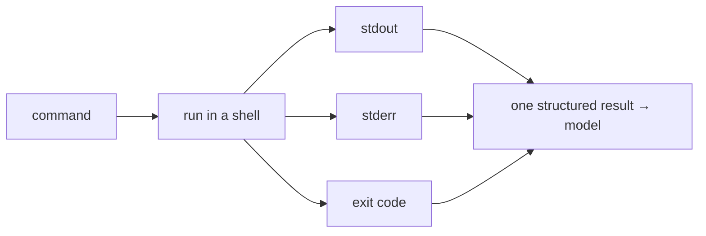

# A Bash Tool: Capture stdout, stderr, Exit Code

> **Motto** — Running a command means capturing all three of its outputs: stdout, stderr, and exit code.

*Part of Phase 07 — Shell & Sandbox Execution.*

## The Problem

The Bash tool is the agent's most powerful and most dangerous capability — it can run
tests, build, install, and also `rm -rf`. The first requirement is to run a command and
capture its *full* result: stdout **and** stderr (errors often go to stderr) **and** the
exit code (the only reliable success signal). An agent that only sees stdout will think a
failing build succeeded.

## The Concept



Exit code 0 = success; nonzero = failure. The model needs all three to reason about what
happened.

## Build It

`code/bash_tool.py` — capture everything with `subprocess`:

```python
import subprocess

def run(command, cwd=None):
    proc = subprocess.run(command, shell=True, cwd=cwd,
                          capture_output=True, text=True)
    return {"stdout": proc.stdout, "stderr": proc.stderr, "exit_code": proc.returncode}

def format_result(r, max_chars=4000):
    out = r["stdout"] + (("\n[stderr]\n" + r["stderr"]) if r["stderr"] else "")
    if len(out) > max_chars:
        out = out[:max_chars] + f"\n…[truncated]"
    return f"exit={r['exit_code']}\n{out}"
```

```python
print(format_result(run("echo hello && echo oops 1>&2")))
print(format_result(run("exit 3")))     # exit=3
```

The result is one structured block the model reads — exit code first, so failure is obvious;
output truncated (Phase 3 L3) so a noisy command can't blow the budget.

## Use It

This is the **Bash** tool in Claude Code / Codex: it runs your command and returns combined
output with the exit status. Because the exit code is captured, the agent can tell a passing
test run from a failing one — and you should phrase tasks so it *checks* exit codes ("run
the tests and fix failures") rather than eyeballing stdout.

## Ship It

[`code/bash_tool.py`](../../01-bash-tool/code/bash_tool.py) — a command runner capturing
stdout/stderr/exit code with truncation.

## Check Yourself

**Q1.** Why capture the exit code, not just stdout?

- A) style
- B) the exit code is the reliable success/failure signal; stdout alone can mislead
- C) speed
- D) no reason

<details><summary>Answer</summary>B — nonzero exit = failure, even if stdout looks
fine.</details>

**Q2.** Why capture stderr separately?

- A) it's optional
- B) errors and warnings often go to stderr, not stdout
- C) to sort output
- D) no reason

<details><summary>Answer</summary>B — stderr carries the error detail.</details>

**Challenge.** Add a `combined` mode that interleaves stdout and stderr in real time
order (hint: redirect `2>&1`), and note when that's better vs. keeping them separate.

## Related

- Builds on: Phase 3 — [Results & errors](../../../03-tool-engineering/03-results-and-errors/docs/en.md)
- Next: [Timeouts & killing runaway processes](../../02-timeouts/docs/en.md)
- [Roadmap](../../../../ROADMAP.md)
