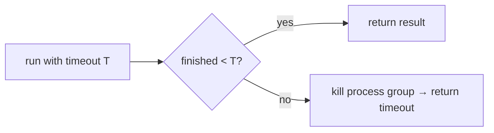

# Timeouts & Killing Runaway Processes

> **Motto** — Every command gets a deadline; a hung process must die, not block the agent forever.

*Part of Phase 07 — Shell & Sandbox Execution.*

## The Problem

A command can hang: a test waiting on input, a server that never exits, an infinite loop.
Without a timeout the agent blocks indefinitely and the whole session stalls. The bash tool
must impose a **deadline** and, on expiry, **kill** the process (and its children) cleanly,
returning a timeout result the model can react to.

## The Concept



Killing the process *group* matters: a shell command may spawn children that outlive the
parent if you only kill the parent.

## Build It

`code/timeout_run.py` — run with a deadline, kill the group on expiry:

```python
import subprocess, os, signal

def run(command, timeout=10):
    proc = subprocess.Popen(command, shell=True, text=True,
                            stdout=subprocess.PIPE, stderr=subprocess.PIPE,
                            start_new_session=True)               # own process group
    try:
        out, err = proc.communicate(timeout=timeout)
        return {"exit_code": proc.returncode, "stdout": out, "stderr": err}
    except subprocess.TimeoutExpired:
        os.killpg(os.getpgid(proc.pid), signal.SIGKILL)           # kill the whole group
        proc.communicate()
        return {"exit_code": -1, "stdout": "", "stderr": f"timeout after {timeout}s"}
```

```python
print(run("echo quick", timeout=5))          # normal result
print(run("sleep 30", timeout=1))            # timeout after 1s, process killed
```

`start_new_session=True` puts the command in its own group so `killpg` reaps children too —
no orphaned `sleep`/servers left running.

## Use It

The **Bash** tool in Claude Code / Codex takes a timeout (with a default and a max) and
kills commands that exceed it; that's why you set a generous timeout for a slow build but
the agent never hangs forever. For genuinely long-running things (a dev server), you don't
raise the timeout — you background it (next lesson).

## Ship It

[`code/timeout_run.py`](../../02-timeouts/code/timeout_run.py) — a timeout runner that kills
the process group on expiry.

## Check Yourself

**Q1.** Why kill the process *group*, not just the parent?

- A) it's faster
- B) the command may spawn children that survive if only the parent is killed
- C) the OS requires it
- D) no reason

<details><summary>Answer</summary>B — group kill reaps orphaned children.</details>

**Q2.** A command needs to run for an hour (a dev server). You should…

- A) raise the timeout to an hour
- B) run it as a background task (next lesson), not block the loop
- C) skip the timeout
- D) split it

<details><summary>Answer</summary>B — background long-running processes.</details>

**Challenge.** Try `SIGTERM` first, wait briefly for graceful shutdown, then `SIGKILL` —
a kinder kill sequence.

## Related

- Builds on: [Bash tool](../../01-bash-tool/docs/en.md)
- Next: [Background tasks](../../03-background-tasks/docs/en.md)
- [Roadmap](../../../../ROADMAP.md)
