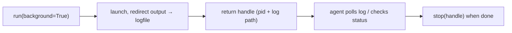

# Background Tasks & Long-Running Commands

> **Motto** — A dev server doesn't block the agent — start it, get a handle, keep working.

*Part of Phase 07 — Shell & Sandbox Execution.*

## The Problem

Some commands are *supposed* to run indefinitely: a dev server, a file watcher, a tail. You
can't run these in the foreground (they'd block the loop) and you can't timeout-kill them
(you want them alive). The bash tool needs a **background** mode: launch the process, return
a handle immediately, stream its output to a log the agent can poll, and let the agent stop
it later.

## The Concept



## Build It

`code/background.py` — a tiny background-job manager:

```python
import subprocess, tempfile, os, signal

class BackgroundJobs:
    def __init__(self):
        self.jobs = {}                         # id -> (proc, logpath)

    def start(self, command):
        log = tempfile.mktemp(suffix=".log")
        f = open(log, "w")
        proc = subprocess.Popen(command, shell=True, stdout=f, stderr=subprocess.STDOUT,
                                start_new_session=True)
        self.jobs[proc.pid] = (proc, log)
        return {"id": proc.pid, "log": log}

    def output(self, job_id):
        _, log = self.jobs[job_id]
        with open(log) as f:
            return f.read()

    def status(self, job_id):
        proc, _ = self.jobs[job_id]
        return "running" if proc.poll() is None else f"exited({proc.returncode})"

    def stop(self, job_id):
        proc, _ = self.jobs[job_id]
        if proc.poll() is None:
            os.killpg(os.getpgid(proc.pid), signal.SIGTERM)
        return "stopped"
```

```python
import time
jobs = BackgroundJobs()
h = jobs.start("for i in 1 2 3; do echo line $i; sleep 0.1; done")
time.sleep(0.5)
print(jobs.status(h["id"]), "|", jobs.output(h["id"]).split())
jobs.stop(h["id"])
```

The agent gets a handle instantly, polls the log to see progress, and stops the job when the
task is done — without ever blocking the loop.

## Use It

This is the **Bash** tool's background mode in Claude Code / Codex (`run_in_background`):
start a dev server, then keep editing while it runs, reading its log to check for errors,
and killing it at the end. Pair it with the timeout runner (lesson 02) for foreground
commands — deadline for short ones, background for long ones.

## Ship It

[`code/background.py`](../../03-background-tasks/code/background.py) — a background-job manager
(start / output / status / stop).

## Check Yourself

**Q1.** Why background a dev server instead of raising the timeout?

- A) it's faster
- B) it should stay alive; backgrounding returns a handle without blocking the loop
- C) timeouts are banned
- D) no reason

<details><summary>Answer</summary>B — long-lived processes belong in the
background.</details>

**Q2.** How does the agent see a background job's progress?

- A) it can't
- B) by polling the job's log file (and checking status)
- C) via stdout only
- D) it waits for exit

<details><summary>Answer</summary>B — output streams to a log it polls.</details>

**Challenge.** Add `wait_for(job_id, pattern, timeout)` that blocks until a line matching
`pattern` appears in the log (e.g. "Listening on") or times out.

## Related

- Builds on: [Timeouts](../../02-timeouts/docs/en.md)
- Next: [Working-directory & shell-state pitfalls](../../04-cwd-and-state/docs/en.md)
- [Roadmap](../../../../ROADMAP.md)
