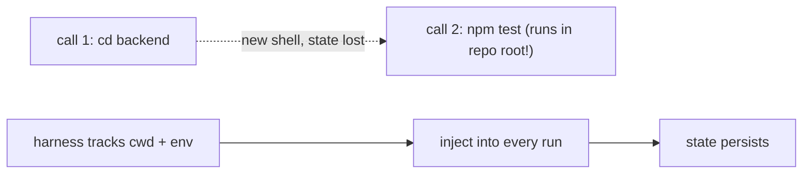

# Working-directory & shell-state pitfalls

> **Motto** — Each command runs in a fresh shell — `cd` doesn't persist unless the harness makes it.

*Part of Phase 07 — Shell & Sandbox Execution.*

## The Problem

A subtle, common bug: the agent runs `cd backend`, then `npm test`, and the test runs in the
*wrong* directory. Why? Each tool call spawns a new shell, so environment changes — `cd`,
`export`, activated venvs — **don't persist** between calls. If the harness doesn't track
working directory and env itself, multi-step shell workflows silently break.

## The Concept



The fix: the harness keeps a session `cwd` (and env) and applies it to each command, OR you
write compound commands (`cd backend && npm test`) so state lives within one call.

## Build It

`code/shell_session.py` — a session that persists cwd across calls:

```python
import subprocess, os

class ShellSession:
    def __init__(self, cwd=None, env=None):
        self.cwd = cwd or os.getcwd()
        self.env = dict(os.environ, **(env or {}))

    def run(self, command):
        # Detect a leading `cd X` and update session cwd (simplified).
        if command.strip().startswith("cd "):
            target = command.strip()[3:].strip()
            new = os.path.normpath(os.path.join(self.cwd, target))
            if os.path.isdir(new):
                self.cwd = new
                return {"exit_code": 0, "stdout": f"cwd={self.cwd}", "stderr": ""}
            return {"exit_code": 1, "stdout": "", "stderr": f"no such dir: {target}"}
        p = subprocess.run(command, shell=True, cwd=self.cwd, env=self.env,
                           capture_output=True, text=True)
        return {"exit_code": p.returncode, "stdout": p.stdout, "stderr": p.stderr}
```

```python
import tempfile, os
d = tempfile.mkdtemp(); os.mkdir(os.path.join(d, "sub"))
s = ShellSession(cwd=d)
s.run("cd sub")
print(s.run("pwd")["stdout"].strip().endswith("/sub"))   # True — cwd persisted
```

Now `cd` "sticks" across calls because the session owns the working directory, not the
ephemeral shell.

## Use It

In Claude Code / Codex the shell environment **doesn't** persist between Bash calls — this
is documented behavior. The practical rules: use absolute paths, or chain with `&&` in one
command, rather than relying on a prior `cd`. The session pattern here is what a custom
harness builds to make state persist deliberately.

## Ship It

[`code/shell_session.py`](../../04-cwd-and-state/code/shell_session.py) — a shell session that
persists working directory across calls.

## Check Yourself

**Q1.** After `cd backend` in one Bash call, the next call runs in…

- A) backend
- B) the original directory — shell state doesn't persist between calls
- C) the home directory
- D) a random directory

<details><summary>Answer</summary>B — each call is a fresh shell.</details>

**Q2.** A reliable way to run a command in a subdir in one call is…

- A) `cd subdir` then a separate call
- B) `cd subdir && command` (compound) or an absolute path
- C) hope
- D) export a variable

<details><summary>Answer</summary>B — keep state within one call.</details>

**Challenge.** Extend the session to also persist `export VAR=value` across calls (track env
the way it tracks cwd).

## Related

- Builds on: [Bash tool](../../01-bash-tool/docs/en.md)
- Next: [Sandboxing](../../05-sandboxing/docs/en.md)
- [Roadmap](../../../../ROADMAP.md)
