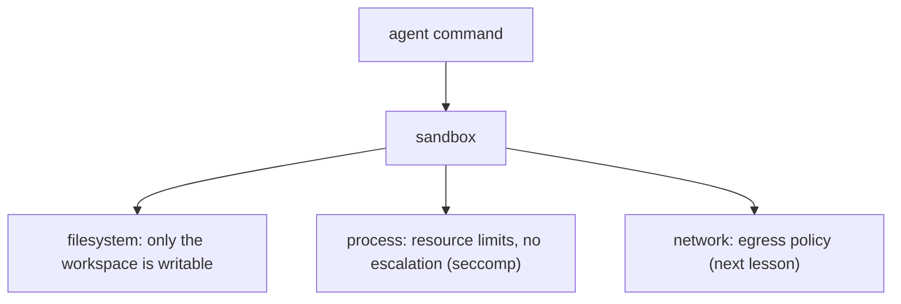

# Sandboxing: containers, namespaces, seccomp

> **Motto** — Give the agent a room it can't escape, not the keys to the whole house.

*Part of Phase 07 — Shell & Sandbox Execution.*

## The Problem

The bash tool runs arbitrary commands the model chose, possibly influenced by untrusted
content (Phase 17). Even with permission gating, you want a *containment* layer so a bad
command can't read your SSH keys, wipe your home directory, or call out to the internet. That
layer is the sandbox: filesystem, process, and network isolation around execution.

## The Concept



Layers, weakest-trust to strongest: a separate working directory, OS resource limits, Linux
namespaces / seccomp, and full containers/VMs. More isolation = more safety, more setup.

## Build It / Use It

Real sandboxing is OS-level, so this is **Use It**. `code/sandbox_demo.py` shows the cheapest
useful layer you can apply from Python — run a command with reduced privileges and resource
limits via `resource` + a restricted cwd/env (the deeper layers are containers/namespaces):

```python
import subprocess, resource, os

def run_limited(command, workdir, cpu_seconds=5, max_mem_mb=256):
    def set_limits():
        resource.setrlimit(resource.RLIMIT_CPU, (cpu_seconds, cpu_seconds))
        soft = max_mem_mb * 1024 * 1024
        resource.setrlimit(resource.RLIMIT_AS, (soft, soft))
    env = {"PATH": "/usr/bin:/bin", "HOME": workdir}        # minimal env, no secrets
    p = subprocess.run(command, shell=True, cwd=workdir, env=env,
                       preexec_fn=set_limits, capture_output=True, text=True)
    return {"exit_code": p.returncode, "stdout": p.stdout, "stderr": p.stderr}
```

```python
import tempfile
print(run_limited("echo sandboxed && pwd", tempfile.mkdtemp())["stdout"])
```

This caps CPU/memory and strips the environment to the workspace — a real (if minimal)
containment step. Production harnesses go further: a container or microVM per session.

## Use It

This is exactly why **Claude Code on the web / Codex cloud** run in **isolated, ephemeral
containers**: the repo is cloned fresh, execution is contained, and the box is reclaimed
after. Locally, Claude Code uses permission gating (Phase 8) plus OS sandboxing where
available. The takeaway: never run an agent's shell with your full user privileges if you can
contain it.

## Ship It

[`code/sandbox_demo.py`](../../05-sandboxing/code/sandbox_demo.py) — a resource-limited,
minimal-env command runner (the first sandbox layer).

## Check Yourself

**Q1.** Why sandbox shell execution even with permission gating?

- A) redundancy is bad
- B) defense in depth — containment limits damage if a bad command slips through
- C) speed
- D) no reason

<details><summary>Answer</summary>B — gating decides *whether*; the sandbox limits *blast
radius*.</details>

**Q2.** The strongest common isolation for an agent session is…

- A) a separate folder
- B) a container or microVM per session
- C) a long prompt
- D) a timeout

<details><summary>Answer</summary>B — containers/VMs give full isolation.</details>

**Challenge.** Add a read-only bind of the repo plus a writable `/tmp` (conceptually), and
list which of your secrets would still be reachable from inside the minimal env.

## Related

- Builds on: [Bash tool](../../01-bash-tool/docs/en.md)
- Next: [Network policies & egress control](../../06-egress-control/docs/en.md)
- Deepens in: Phase 8 — Permissions, Phase 17 — Security
- [Roadmap](../../../../ROADMAP.md)
