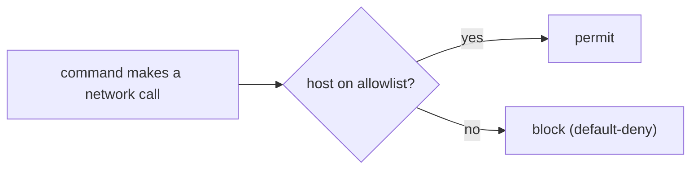

# Network Policies & Egress Control

> **Motto** — Decide what the agent may reach before it runs, not after it exfiltrates.

*Part of Phase 07 — Shell & Sandbox Execution. Completes the phase.*

## The Problem

The most dangerous thing a compromised or misled agent can do is *call home* — POST your
source or secrets to an attacker's server (a prompt-injection payoff, Phase 17). Filesystem
sandboxing doesn't stop this; you need **egress control**: an allowlist of hosts the agent's
commands may reach, denying everything else by default.

## The Concept



Default-deny is the rule: enumerate the few hosts you need (package registries, your APIs)
and block the rest, so an unexpected exfiltration attempt simply fails.

## Build It / Use It

True egress control is enforced at the network/OS layer (firewall, proxy, container netpol),
so this is **Use It**. The harness-side artifact is a **PreToolUse hook** that inspects a
command and blocks obvious egress to non-allowlisted hosts. `outputs/egress-guard.sh`:

```bash
#!/usr/bin/env bash
# PreToolUse hook: block curl/wget/nc to hosts not on the allowlist. Exit 2 = deny.
ALLOW="registry.npmjs.org pypi.org github.com api.anthropic.com"
cmd="$(cat)"   # tool-call JSON on stdin
urls="$(printf '%s' "$cmd" | grep -oE 'https?://[a-zA-Z0-9.-]+' | sed -E 's#https?://##')"
for host in $urls; do
  case " $ALLOW " in
    *" $host "*) ;;                                   # allowed
    *) echo "BLOCKED egress to $host (not on allowlist)" >&2; exit 2 ;;
  esac
done
exit 0
```

This is a *belt* (cheap, harness-level); the *suspenders* is an actual network policy
(default-deny firewall / proxy) that the hook can't be tricked past.

## Use It

This is precisely what the **network policy** on Claude Code on the web / Codex cloud does:
the environment's outbound access is governed by a chosen policy (e.g. no network, or an
allowlist), enforced at the infrastructure layer. Locally, you add a hook like this plus your
OS firewall. Either way: default-deny, allowlist the few hosts you trust.

## Ship It

[`outputs/egress-guard.sh`](../../06-egress-control/outputs/egress-guard.sh) — a PreToolUse
egress-allowlist hook.

## Check Yourself

**Q1.** What's the right default for agent network egress?

- A) allow all
- B) default-deny with a small allowlist of trusted hosts
- C) allow internal only
- D) no policy

<details><summary>Answer</summary>B — deny by default; allowlist what you need.</details>

**Q2.** Why isn't a PreToolUse hook alone sufficient?

- A) it is
- B) a clever command can evade text inspection; real enforcement is at the network layer
- C) hooks are slow
- D) no reason

<details><summary>Answer</summary>B — the hook is a cheap belt; the firewall/proxy is the
real wall.</details>

**Challenge.** Extend the hook to also catch egress in `python -c` / `node -e` one-liners,
and note why a network-layer policy is still required.

## Related

- Builds on: [Sandboxing](../../05-sandboxing/docs/en.md)
- Deepens in: Phase 8 — Permissions (hooks), Phase 17 — Security (exfiltration)
- Phase complete → next: Phase 8 — [Permissions & Safety Gating](../../../../ROADMAP.md)
- [Roadmap](../../../../ROADMAP.md)
