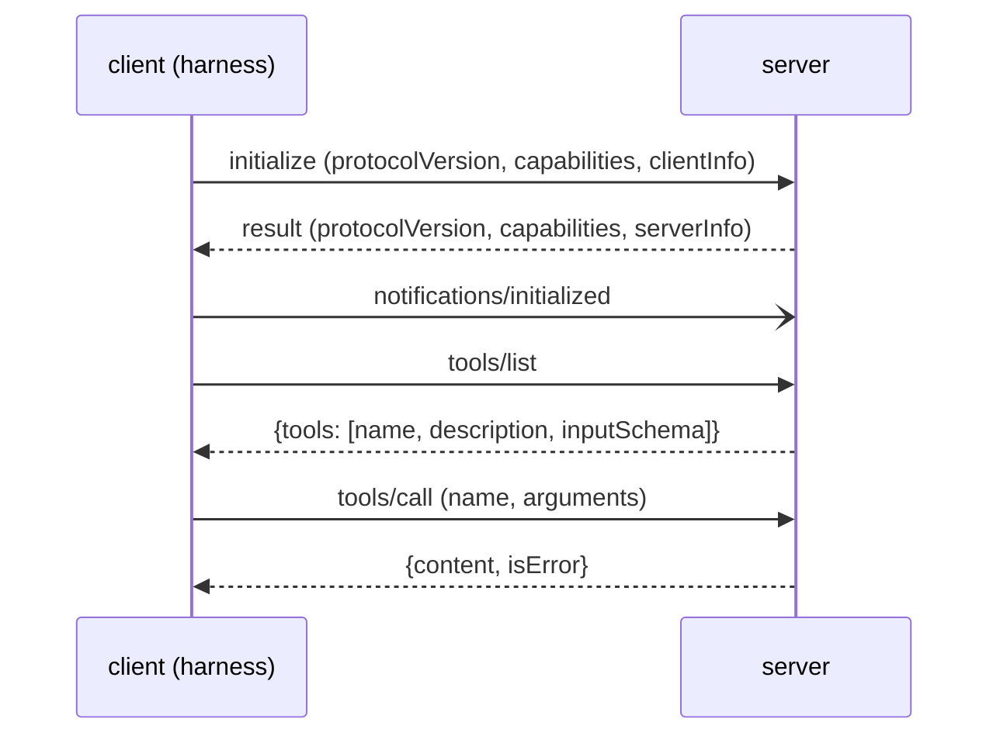

# The MCP Protocol: Server and Client

> **Motto** — MCP is JSON-RPC over a pipe: shake hands, list the tools, call them, and report failures in the right place.

*Part of Phase 08 — Extending: MCP, Skills, Retrieval.*

*Last reviewed: 2026-10 · Volatility: fast*

## The Problem

An agent needs tools that live outside the harness: a database, a ticket system, a browser. Writing a custom adapter for each one does not scale.

The **Model Context Protocol (MCP)** is the shared wire format. A **server** exposes tools. A **client** inside the harness discovers them and calls them. Once the model sees a server tool, it looks like any built-in tool.

If you know the messages, you can debug a server that fails to appear. Most failures happen in the handshake or in the tool list.

## The Concept



MCP uses JSON-RPC 2.0. A request has an `id`, a `method` and `params`. A **notification** has no `id` and gets no reply. The client sends `initialize` first, then the `notifications/initialized` notification. Only then does normal work begin.

Errors have two homes. A **protocol error** (unknown method, unknown tool) is a JSON-RPC `error`. A **tool failure** (the tool ran and broke) is a normal result with `isError: true`. The model reads the second kind and can recover. It never sees the first kind.

## Build It

`code/mcp_stdio.py` holds a working server and client in one file. The client starts the server as a subprocess and talks over its stdin and stdout. The `handle` function is the whole server. Its tool branch shows the two error homes:

```python
    elif method == "tools/call":
        p = msg.get("params", {})
        if p.get("name") not in {t["name"] for t in TOOLS}:      # protocol error
            return {"jsonrpc": "2.0", "id": mid, "error": {
                "code": -32602, "message": f"Unknown tool: {p.get('name')}"}}
        try:
            text, is_error = str(run_tool(p["name"], p.get("arguments", {}))), False
        except Exception as e:                # tool failure: a result with isError
            text, is_error = f"{type(e).__name__}: {e}", True
        result = {"content": [{"type": "text", "text": text}], "isError": is_error}
```

The file follows the stdio rules. Each message is one line of JSON, with no embedded newline. The server writes only protocol messages to stdout and sends its logs to stderr. The client calls `json.loads` on every stdout line, so a stray print would crash it.

The asserts walk the full flow. A `tools/list` before the handshake fails. `initialize` returns the version and server info. `tools/list` returns the three required fields. `add` returns `"5"`. `divide` by zero returns `isError: true` as a result, not as an error. An unknown tool returns code `-32602`.

This server holds no state and writes nothing to disk. It also skips resources and prompts, the two other MCP capabilities. A server may offer any mix of tools, resources and prompts.

## Use It

You do not write this by hand in production. Claude Code is the client. Add a stdio server like this:

```bash
claude mcp add my-server -- python3 server.py
```

For a remote server, use HTTP:

```bash
claude mcp add --transport http notion https://mcp.notion.com/mcp
```

The `--` separates Claude's options from the server command. Project-shared servers go in `.mcp.json` at the project root, under the `mcpServers` key. Run `/mcp` in a session to see server status.

MCP has two standard transports. **stdio** runs the server as a subprocess, as you built. **Streamable HTTP** serves one endpoint that takes POST (and optionally GET) and may stream replies with SSE. It replaced the older HTTP+SSE transport, and Claude Code marks SSE as deprecated. A local HTTP server must validate the `Origin` header and bind to localhost.

When a server's tools do not show up, check `initialize` and `tools/list`. Also check stdout. Any non-protocol output there breaks a stdio server.

## Challenge

Add a `resources/list` and `resources/read` pair that serves one file from a directory you choose. Reject any URI that escapes that directory, and assert that `../secret` fails.

## Sources

MCP specification 2025-06-18: lifecycle, transports, tools. Claude Code docs, "Connect to tools via MCP" (code.claude.com/docs).

Next: [The official MCP SDK](../../02-official-mcp-sdk/docs/en.md)
