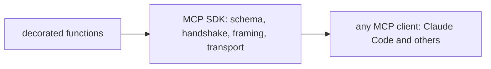

# The Official MCP SDK

> **Motto** — You know the protocol now, so let the SDK write the framing and keep your effort on the tools.

*Part of Phase 08 — Extending: MCP, Skills, Retrieval.*

*Last reviewed: 2026-10 · Volatility: fast*

## The Problem

In [lesson 01](../../01-mcp-protocol-server-client/docs/en.md) you wrote the handshake, the dispatch and the error rules by hand. That was for learning. In production the work is repetitive and easy to get wrong. One missed `isError` or one stray `print` breaks every client.

The official **MCP SDK** does that work. You write a plain function. The SDK builds the schema, runs the handshake, picks the transport and shapes the result. The SDK is also a fast-moving package, so you must check which version you have.

## The Concept



You declare tools. The SDK turns each function signature into an `inputSchema` and its docstring into a description. It then serves them over a transport. A tool needs three things from you: a clear name, type hints and a docstring. The model reads that docstring as the tool's manual, so write it for the model.

## Build It

The first file removes the magic. `code/tool_decorator.py` is a stdlib version of what the SDK decorator does. It reads the signature and builds the `tools/list` entry:

```python
def tool(fn):
    """Register fn as a tool. The schema comes from its signature and docstring."""
    props, required = {}, []
    for name, p in inspect.signature(fn).parameters.items():
        props[name] = {"type": JSON_TYPES[p.annotation]}
        if p.default is inspect.Parameter.empty:
            required.append(name)
        else:
            props[name]["default"] = p.default
    spec = {"name": fn.__name__, "description": inspect.getdoc(fn),
            "inputSchema": {"type": "object", "properties": props, "required": required}}
    TOOLS[fn.__name__] = {"spec": spec, "fn": fn}
    return fn
```

A parameter with a default is optional. A parameter without one goes in `required`. The `call` function checks required arguments and returns an `isError` result when one is missing. The asserts confirm each rule. The real SDK covers far more types than this toy, including nested types and return schemas.

## Use It

Install the SDK with `pip install mcp`. The shape changed between major versions. In `mcp` 1.x you write `from mcp.server.fastmcp import FastMCP`. In `mcp` 2.x the class is `MCPServer`, imported with `from mcp.server import MCPServer`. I ran the files below against `mcp` 2.2.0. Pin a version in your own project.

`code/notes_server_sdk.py` is a small notes server with two tools and one resource. It writes notes to a JSON file, so they survive a restart:

```python
@mcp.tool()
def remember(note: str) -> str:
    """Save a note to disk."""
    notes = _load()
    notes.append(note)
    NOTES_FILE.write_text(json.dumps(notes))
    return f"saved ({len(notes)} notes)"
```

`mcp.run()` serves over stdio. `mcp.run("streamable-http")` serves over HTTP. A memory server persists only if it writes somewhere, as this one does. A server that keeps notes in a Python list loses them when the process exits.

`code/notes_client_sdk.py` starts the server with the SDK client, lists the tools and saves a note. It then starts a second server process and reads the note back. That check needs the `mcp` package, so it is not part of the offline set. Register the server with Claude Code like this:

```bash
claude mcp add notes -- python3 code/notes_server_sdk.py
```

In my check, the SDK negotiated a protocol revision newer than the 2025-06-18 shapes in lesson 01. Read the revision your SDK reports before you depend on field details.

## Challenge

Add a `forget(note: str)` tool to `notes_server_sdk.py` that removes one note. Extend `notes_client_sdk.py` so a second process confirms the note is gone. Make it raise an exception when the note does not exist. In `mcp` 2.2.0 the client then receives a result with `is_error` set. Assert that, and read the error text. Note how little detail it holds.

## Sources

MCP Python SDK README and migration notes (github.com/modelcontextprotocol/python-sdk). Claude Code docs, "Connect to tools via MCP" (code.claude.com/docs).

Next: [Skills and deferred loading](../../03-skills-and-deferred-loading/docs/en.md)
