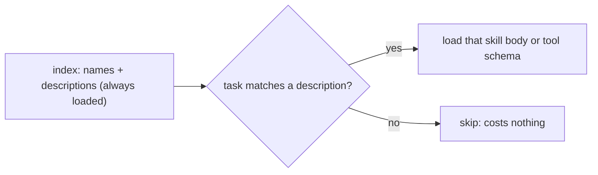

# Skills and Deferred Loading

> **Motto** — Keep a cheap index in context and load the expensive part (a skill body, a tool schema) only when the task needs it.

*Part of Phase 08 — Extending: MCP, Skills, Retrieval.*

*Last reviewed: 2026-10 · Volatility: fast*

## The Problem

An agent can gain many abilities: workflows, rubrics, and hundreds of tools from MCP servers. If you put all of it in context, the window fills before the task starts. Cost rises. The model also picks worse, because it must choose from a crowd.

Most tasks need one or two of these abilities. You pay for all of them on every turn.

The fix is **progressive disclosure**. Keep a small index in context: a name and a short description for each item. Load the full text only for the item the task needs.

## The Concept



Two things use this pattern. A **skill** is a folder with a `SKILL.md` file: a header with a name and description, then a body of instructions. A **deferred tool** is a tool whose name is listed but whose schema is not loaded yet.

The description does the work. It is the only thing the model sees before it decides. A vague description never triggers. A description that lists concrete cases triggers when it should.

## Build It

`code/skills.py` has three parts. `parse_skill` splits a `SKILL.md` into header fields and body. `SkillIndex` reads every skill at startup but keeps only the description. The body is read when you call `load`:

```python
    def load(self, name):
        self.body_reads += 1                         # the expensive step
        return parse_skill(self.paths[name].read_text())[1]
```

The `match` method is a stand-in. It counts words shared between the task and each description. In a real agent the model makes that choice by reading the descriptions.

`DeferredTools` does the same for tool schemas. It lists names, supports `search`, and fetches a schema once, then caches it:

```python
    def load(self, name):
        if name not in self.cache:
            self.fetches += 1
            self.cache[name] = self.loaders[name]()
        return self.cache[name]
```

The asserts prove the claims. Startup reads no bodies. The index costs under a tenth of the bodies (the file estimates tokens as characters divided by four). A task with no match loads nothing. A schema is fetched once.

`outputs/SKILL.md` is a real skill you can install. It is a `pr-description` skill, and the test parses it.

## Use It

Claude Code loads skills from folders. Put the file at `.claude/skills/pr-description/SKILL.md` for one project, or `~/.claude/skills/` for all your projects. The file for this lesson is `outputs/SKILL.md`. At startup, Claude Code loads each skill's name and description. The body loads when the skill is used. You can also run it yourself with `/pr-description`.

The header accepts these fields (all optional): `name`, `description`, `when_to_use`, `argument-hint`, `arguments`, `disable-model-invocation`, `user-invocable`, `allowed-tools`, `disallowed-tools`, `model`, `effort`, `context`, `agent`, `background`, `hooks`, `paths`, `shell`, `metadata`, `license` and `compatibility`. Unknown fields are ignored without an error, so a typo fails silently.

Two details matter. Claude Code truncates `description` plus `when_to_use` at 1,536 characters in the listing, so put the main use case first. And `allowed-tools` pre-approves tools only for the turn that runs the skill. It does not restrict other tools and it cannot override a deny rule.

Deferred tools work the same way in Claude Code. It uses a `ToolSearch` step to find MCP tools on demand. For a remote server you have used before, it can load the tool list from a cache and connect only on first use.

## Challenge

Add an LRU cap to `DeferredTools`. Keep at most two schemas cached. Assert that loading a third evicts the least recently used one, and that loading the evicted one fetches it again.

## Sources

Claude Code docs, "Extend Claude with skills" and "Connect to tools via MCP" (code.claude.com/docs).

Next: [The repo map](../../04-repo-map/docs/en.md)
